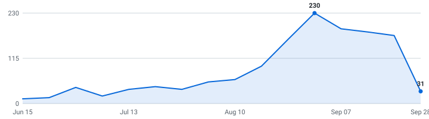

# 🎓 Summer 2027 Tech Internships

**A self-updating engine that tracks tech internships so you don't have to.**

&nbsp;&nbsp;&nbsp;

### 964 open roles (594 listed below) · 173 new this week

4,666 employers tracked · data as of Oct 02, 2026 at 13:26 UTC

_655 have a cycle the employer stated · 309 are recent postings whose cycle isn't stated (listed separately, never mixed in)._

**[🖥️ Live dashboard](https://superasymmetry.github.io/internship-alerts/)** · **[📡 RSS](https://superasymmetry.github.io/internship-alerts/feed.xml)** · **[⚙️ JSON API](https://superasymmetry.github.io/internship-alerts/api/jobs.json)** · **[🔔 Personal alerts](PERSONAL_SETUP.md)**

> [!TIP]
> **⭐ Star this repo** to save it and get updates when new roles are added.

Instead of refreshing a dozen career pages by hand, it reads company hiring feeds directly and keeps one live list — newest roles on top, refreshed automatically throughout the day.

**🔔 Personal instant alerts:** this fork can email one private destination after every successful 30-minute scan. See [PERSONAL_SETUP.md](PERSONAL_SETUP.md).

---

## What this is

This is an engine, not a hand-kept list. It polls company career feeds every 30 minutes, finds the internships, removes duplicates, and rebuilds this page on its own.

Every link comes straight from the source — so it's real and current, not a stale list someone forgot to update. Speed matters.

## What makes this different

| | |
|---|---|
| 📅 **[Drop Radar](#drop-radar)** | A forecast of **what's coming**. Each marquee company's typical opening window, replaced by the real drop date the moment the engine catches it live. Windows are estimates and labelled as such; only dates the engine saw itself are marked verified. |
| 🛂 **Visa intel, computed** | 🇺🇸 / 🛂 flags detected automatically from every job description, plus ✓ for employers with a real H-1B track record (USCIS data, FY2022-23 — a history, not a promise). The big lists crowdsource this by hand; here it's code. Most postings say nothing either way, and those show as unknown rather than guessed. |
| 📆 **A real date on nearly every role** | Taken from the job portal itself wherever the portal states one, so newest-first actually means newest. The exact coverage figure is printed at the bottom of this page every run. |
| 🧰 **Skill tags + pay, extracted** | Every posting's text is scanned for the stack it wants (Python, C++, PyTorch, …) and the pay it states — searchable on the [dashboard](https://superasymmetry.github.io/internship-alerts/), and included in the CSV and API. |
| 🔔 **Alerts your way** | [Email digests](https://superasymmetry.github.io/internship-alerts/#subscribe) or [RSS](https://superasymmetry.github.io/internship-alerts/feed.xml) — point any reader, or a Slack/Discord RSS integration, at it. Plus a [live dashboard](https://superasymmetry.github.io/internship-alerts/) with search, filters, and a saved-roles list that never leaves your browser. |
| ⚙️ **An engine, not a spreadsheet** | 4,934 job-board endpoints (4,666 distinct employers; some run more than one board) polled every 30 minutes across 12 ATS platforms. Full source and tests in this repo. |

## Scope

| | |
|---|---|
| **Roles** | Software Engineering, Data Science & Machine Learning (and closely related technical internships) |
| **Region** | United States |
| **Cycles** | Summer 2027 and Fall 2026 |

## About

I'm an international student studying in the United States, so I built this for the search I'm doing myself. The list is US roles only for now — that's where I'm searching.

Use it to spot roles early and apply before they fill up. Being first genuinely helps.

## Where this is going

I'm building this in the open and adding to it as it grows.

**Recently shipped:** email alerts · the Drop Radar · auto-detected sponsorship flags · the live dashboard

**Next up:** personalized alerts (pick your categories) · per-company hiring pages · a ghost-posting detector

If it helps you, a star means a lot and tells me to keep going.

## How to use

<b>Reading the table — flags, dates, and the cycle split</b> (click to expand)

- Roles are grouped by cycle below - **newest posting on top, oldest at the bottom.**
- A cycle section holds only roles whose **employer stated that cycle** - in the title, or in the posting's own text. Postings that name no cycle anywhere are in *Recently posted — cycle not stated* further down, with **no cycle guessed for them**. Same quality bar, different amount of evidence.
- The **Posted** column is the date the company published the role.
- **_(3 openings)_ after a role title** = the employer has that many separate live requisitions for the same job, in the same place, for the same cycle. They're all real and each takes its own application, so they're linked individually (**Apply**, then **#2**, **#3**) instead of repeating the row. Counts still count requisitions, and the CSV export is never grouped.
- **🆁 after a company name** = **this role is remote** — the posting's own location or title says so. It marks the role on that row, not the whole company.
- **Flags after a role title:** 🇺🇸 = requires U.S. citizenship or a security clearance · 🛂 = the posting says it won't sponsor a work visa · 🆕 = spotted in the last 48 hours. Sponsorship flags are detected automatically from each job description - treat them as a strong hint and confirm on the posting.
- **✓ after a company name** = a real H-1B track record: USCIS approved 10+ petitions for that employer in FY2022–2023 (matched automatically against the official [H-1B Employer Data Hub](https://www.uscis.gov/tools/reports-and-studies/h-1b-employer-data-hub)). No ✓ doesn't mean they won't sponsor - it means we can't prove they have.
- Track your applications with [`data/internships.csv`](data/internships.csv) (opens in Excel / Google Sheets).
- Missing a company? Adding one takes a single line, see [CONTRIBUTING.md](CONTRIBUTING.md).

---

## Summer 2027  (300 employer-stated)

| Company | Role | Category | Location | Skills | Posted | Apply |
|---|---|---|---|---|---|---|
| CACI | Network / Cybersecurity Intern - Summer 2027 🆕 _(3 openings)_ | Security | High Point, NC, US | No skills listed | Oct 02, 2026 | [Apply](https://caci.wd1.myworkdayjobs.com/external/job/High-Point-NC-US/Network---Cybersecurity-Intern---Summer-2027_333001) [#2](https://caci.wd1.myworkdayjobs.com/external/job/High-Point-NC-US/Network---Cybersecurity-Intern---Summer-2027_333005) [#3](https://caci.wd1.myworkdayjobs.com/external/job/High-Point-NC-US/Network---Cybersecurity-Intern---Summer-2027_333034-1) |
| Pinterest ✓ 🆁 | Software Engineer Intern 2027 (USA) 🆕 | Software | San Francisco, CA, US; Remote, US | Python, Java, C++, TypeScript | Oct 01, 2026 | [Apply](https://www.pinterestcareers.com/jobs/?gh_jid=7838577) |
| Pinterest ✓ | Master's Machine Learning Internship 2027 (USA) 🆕 | Data & ML/AI | San Francisco +11 more | Python, Java, C++, PyTorch | Oct 01, 2026 | [Apply](https://www.pinterestcareers.com/jobs/?gh_jid=8138090) |
| General Motors ✓ | 2027 Summer Intern - AI/ML Engineer, Autonomous Vehicle: Simulation 🆕 | Data & ML/AI | Sunnyvale +2 more | Python, Java, C++, PyTorch | Oct 01, 2026 | [Apply](https://generalmotors.wd5.myworkdayjobs.com/Careers_GM/job/Sunnyvale-California-United-States-of-America/XMLNAME-2027-Summer-Intern---AI-ML-Engineer--Autonomous-Vehicle--Simulation_JR-202621508) |
| General Motors ✓ | 2027 Summer Intern - Software Engineer, Autonomous Vehicle: Simulation 🆕 | Software | Sunnyvale +2 more | Python, C++ | Oct 01, 2026 | [Apply](https://generalmotors.wd5.myworkdayjobs.com/Careers_GM/job/Sunnyvale-California-United-States-of-America/XMLNAME-2027-Summer-Intern---Software-Engineer--Autonomous-Vehicle--Simulation_JR-202621503) |
| Walleye Capital | Special Projects Developer Intern (Summer 2027) 🆕 | Software | New York, New York | Python, SQL, LLMs | Oct 01, 2026 | [Apply](https://job-boards.greenhouse.io/walleyecapital-external-students/jobs/4716166006) |
| CoStar Group | Embedded Software Engineering Intern 🛂 🆕 | Software | Sunnyvale (US) | Python, C++, MATLAB, PyTorch | Oct 01, 2026 | [Apply](https://costar.wd1.myworkdayjobs.com/Costar_Campus/job/Sunnyvale-US/Embedded-Software-Engineering-Intern_R39950) |
| HMH | AI & Automation Development Intern 🆕 | Data & ML/AI | Houston, TX | Python, SQL, LLMs | Oct 01, 2026 | [Apply](https://hmhw.wd12.myworkdayjobs.com/hmh_careers/job/Houston-TX/AI---Automation-Development-Intern_JR102458) |
| Riot Games ✓ 🆁 | Software Engineering Intern - Summer 2027 (Remote) 🛂 🆕 | Software | Los Angeles, USA | Java, C++, C#, Git | Oct 01, 2026 | [Apply](https://job-boards.greenhouse.io/riotgamesup/jobs/8222015) |
| Stantec | Transportation Engineering Intern - Infrastructure (Summer 2027) 🆕 | Software | Atlanta, GA, United States | No skills listed | Oct 01, 2026 | [Apply](https://hdhl.fa.us6.oraclecloud.com/hcmUI/CandidateExperience/en/sites/CX_1/job/1008089) |
| ATC | Intern - Cyber Security Summer 2027 🆕 | Security | Pewaukee, WI | No skills listed | Oct 01, 2026 | [Apply](https://atcllc.wd5.myworkdayjobs.com/atcllc/job/Pewaukee-WI/Intern---Cyber-Security-Summer-2027_R0003307) |
| CACI | AI Prompt Engineer High School Intern - Summer 2027 🇺🇸 🆕 | Data & ML/AI | Ashburn, VA, US | Python, Java, JavaScript | Oct 01, 2026 | [Apply](https://caci.wd1.myworkdayjobs.com/external/job/Ashburn-VA-US/AI-Prompt-Engineer-High-School-Intern---Summer-2027_332816-1) |
| CACI | Software Development Intern - Summer 2027 🇺🇸 🆕 | Software | Ashburn, VA, US | Python, Java, C++, TypeScript | Oct 01, 2026 | [Apply](https://caci.wd1.myworkdayjobs.com/external/job/Ashburn-VA-US/Software-Development-Intern---Summer-2027_332790) |
| RTX | Flight Control Software Engineering Intern (Summer 2027) (Open) 🇺🇸 🆕 | Software | US-IA-CEDAR RAPIDS-193 ~ 1120 Collins R… | C++, MATLAB | Oct 01, 2026 | [Apply](https://globalhr.wd5.myworkdayjobs.com/rec_rtx_ext_gateway/job/US-IA-CEDAR-RAPIDS-193--1120-Collins-Rd-NE--BLDG193/Flight-Control-Software-Engineering-Intern--Summer-2027---Open-_01870974) |
| Northrop Grumman | 2027 Software Engineering Intern - Colorado Springs CO 🇺🇸 🆕 | Software | United States-Utah-Roy | No skills listed | Oct 01, 2026 | [Apply](https://ngc.wd1.myworkdayjobs.com/Northrop_Grumman_External_Site/job/United-States-Utah-Roy/XMLNAME-2027-Software-Engineering-Intern---Colorado-Springs-CO_R10254007) |
| The Federal Reserve System | Summer 2027 Intern-Cloud Engineering 🛂 🆕 | Software | Chicago, IL | No skills listed | Oct 01, 2026 | [Apply](https://rb.wd5.myworkdayjobs.com/FRS/job/Chicago-IL/Summer-2027-Intern-Cloud-Engineering_R-0000033614) |
| The Federal Reserve System | Summer 2027 Intern-Computer Science and Software Engineering 🛂 🆕 | Software | Chicago, IL | No skills listed | Oct 01, 2026 | [Apply](https://rb.wd5.myworkdayjobs.com/FRS/job/Chicago-IL/Summer-2027-Intern-Computer-Science-and-Software-Engineering_R-0000033637) |
| The Federal Reserve System | Summer 2027 Intern-Cybersecurity and Information Security 🛂 🆕 | Security | Chicago, IL | No skills listed | Oct 01, 2026 | [Apply](https://rb.wd5.myworkdayjobs.com/FRS/job/Chicago-IL/Summer-2027-Intern-Cybersecurity-and-Information-Security_R-0000033612-1) |
| Old Mission Capital | Quantitative Trader - 2027 Micro-Internship Program (January Start) 🆕 | Quant | Chicago, IL, United States | Python | Oct 01, 2026 | [Apply](https://www.oldmissioncapital.com/careers/?gh_jid=8002345003) |
| Varda Space | Cybersecurity Internship - Summer 2027 🇺🇸 🆕 | Security | El Segundo, California, United States | Python, Bash | Oct 01, 2026 | [Apply](https://job-boards.greenhouse.io/vardaspace/jobs/8005821003) |
| Varda Space | Flight Software Internship - Summer 2027 🇺🇸 🆕 | Software | El Segundo, California, United States | C++, Linux | Oct 01, 2026 | [Apply](https://job-boards.greenhouse.io/vardaspace/jobs/8010159003) |
| Amazon ✓ | Software Development Engineer Intern, AWS Database - 2027 (US) 🆕 | Software | Seattle, Washington, USA | AWS, Python, Java, C++ | Sep 30, 2026 | [Apply](https://www.amazon.jobs/en/jobs/10565667/software-development-engineer-intern-aws-database-2027-us) |
| Allen Control Systems | Software Engineering Intern, UX/UI 2027 🆕 | Software | Austin, TX | Kotlin, Computer Vision | Sep 30, 2026 | [Apply](https://jobs.ashbyhq.com/allen-control-systems/1cd2b432-9a01-4ae0-8eb2-6ebd9c278b94) |
| Muon Space | Flight Software Engineering Intern (Summer 2027) 🆕 | Software | San Jose, CA | Python, C++ | Sep 30, 2026 | [Apply](https://job-boards.greenhouse.io/muonspace/jobs/5247725007) |
| Waymo ✓ | 2027 Summer Intern, BS, Software Engineering, Labeling 🆕 | Software | Mountain View, CA, USA | C++, TypeScript | Sep 30, 2026 | [Apply](https://careers.withwaymo.com/jobs?gh_jid=8238525) |
| Northrop Grumman | 2027 Software Engineer Intern - Rolling Meadows IL 🇺🇸 🆕 | Software | United States-Illinois-Rolling Meadows | No skills listed | Sep 30, 2026 | [Apply](https://ngc.wd1.myworkdayjobs.com/Northrop_Grumman_External_Site/job/United-States-Illinois-Rolling-Meadows/XMLNAME-2027-Software-Engineer-Intern---Rolling-Meadows-IL_R10253772) |
| Northrop Grumman | 2027 Software Engineer Intern - Morrisville NC 🇺🇸 🆕 | Software | United States-North Carolina-Morrisville | No skills listed | Sep 30, 2026 | [Apply](https://ngc.wd1.myworkdayjobs.com/Northrop_Grumman_External_Site/job/United-States-North-Carolina-Morrisville/XMLNAME-2027-Software-Engineer-Intern---Morrisville-NC_R10253768) |
| Dandy | Summer 2027 Internship - Software Engineering Intern 🆕 | Software | USA - New York NY | TypeScript, React, GraphQL | Sep 30, 2026 | [Apply](https://jobs.ashbyhq.com/dandy/d43558e9-8e51-4980-b00d-39275063f099) |
| Stantec | Project Coordinator Intern - Infrastructure (Summer 2027) 🆕 | Software | Raleigh, NC, United States | No skills listed | Sep 30, 2026 | [Apply](https://hdhl.fa.us6.oraclecloud.com/hcmUI/CandidateExperience/en/sites/CX_1/job/1008053) |
| Stantec | Project Coordinator Intern - Infrastructure (Summer 2027) 🆕 | Software | Burlington, MA, United States | No skills listed | Sep 30, 2026 | [Apply](https://hdhl.fa.us6.oraclecloud.com/hcmUI/CandidateExperience/en/sites/CX_1/job/1008055) |
| AMCA | Software Engineering Internship (Summer 2027) 🆕 | Software | El Segundo, CA | Python, TypeScript, SQL, React | Sep 29, 2026 | [Apply](https://job-boards.greenhouse.io/amca/jobs/4425120009) |
| Muon Space | GNC Software Engineering Intern (Summer 2027) | Software | Mountain View, CA | Python, C++ | Sep 29, 2026 | [Apply](https://job-boards.greenhouse.io/muonspace/jobs/5252680007) |
| RTX | Software Engineering Co-op  (Spring/Summer 2027) 🇺🇸 | Software | US-IA-CEDAR RAPIDS-166 ~ 855 35Th St NE… | Python, C++, Bash, Linux | Sep 29, 2026 | [Apply](https://globalhr.wd5.myworkdayjobs.com/rec_rtx_ext_gateway/job/US-IA-CEDAR-RAPIDS-166--855-35Th-St-NE--BLDG-166/Software-Engineering-Co-op---Embedded-Linux--Spring-Summer-2027-_01876384) |
| Marvell | Machine Learning Engineer Intern, BS/MS - Summer 2027 | Data & ML/AI | Santa Clara, CA | Python, CUDA, AWS, GCP | Sep 29, 2026 | [Apply](https://marvell.wd1.myworkdayjobs.com/marvellcareers2/job/Santa-Clara-CA/Machine-Learning-Engineer-Intern--BS-MS---Summer-2027_2603860-1) |
| ICF ✓ | 2027 Summer Intern, AI Engineer (Reston, VA) 🇺🇸 | Data & ML/AI | Reston, VA | Python, Java, C++, JavaScript | Sep 29, 2026 | [Apply](https://icf.wd5.myworkdayjobs.com/ICFExternal_Career_Site/job/Reston-VA/XMLNAME-2027-Summer-Intern--AI-Engineer--Reston--VA-_R2603312-1) |
| Perchwell | Software Engineering Intern | Software | New York Office | TypeScript, SQL, Ruby, React | Sep 29, 2026 | [Apply](https://jobs.ashbyhq.com/perchwell/194eec78-26db-4d8e-850f-a99ea2733e9f) |
| Enova | Software Engineer Internship Summer 2027 (Hybrid) 🛂 | Software | Chicago, IL | Go, Ruby | Sep 29, 2026 | [Apply](https://job-boards.greenhouse.io/enova/jobs/8239619) |
| National Life | Digital & AI Experience Intern – Summer 2027 🛂 | Data & ML/AI | Addison, TX; Montpelier, VT | LLMs | Sep 29, 2026 | [Apply](https://job-boards.greenhouse.io/nationallifeinsurancecompany/jobs/4403876009) |
| Marvell | AI-Native Development Platform Engineer Intern, MS - Summer 2027 | Data & ML/AI | Santa Clara, CA | Python, Java, C#, TypeScript | Sep 29, 2026 | [Apply](https://marvell.wd1.myworkdayjobs.com/MarvellCareers/job/Santa-Clara-CA/AI-Native-Development-Platform-Engineer-Intern--MS---Summer-2027_2603848-1) |
| Q2 | 2027 Summer Internship - Machine Learning Engineer 🛂 | Data & ML/AI | Cary, North Carolina | Python, Java, PyTorch, TensorFlow | Sep 29, 2026 | [Apply](https://q2ebanking.wd5.myworkdayjobs.com/Q2/job/Cary-North-Carolina/XMLNAME-2027-Summer-Internship---Machine-Learning-Engineer_REQ-12800) |
| Q2 | 2027 Summer Internship - Software Engineer 🛂 | Software | Cary, North Carolina | Python, C#, JavaScript, SQL | Sep 29, 2026 | [Apply](https://q2ebanking.wd5.myworkdayjobs.com/Q2/job/Cary-North-Carolina/XMLNAME-2027-Summer-Internship---Software-Engineer_REQ-12798) |
| Upbound Group | ServiceNow Developer Intern | Software | Plano, TX | JavaScript | Sep 29, 2026 | [Apply](https://upbound.wd501.myworkdayjobs.com/Upbound/job/Plano-TX/User-Experience-Intern_R-100778) |
| Lyft ✓ | Applied Scientist Intern (Summer 2027) | Data & ML/AI | San Francisco, CA | Python, LLMs | Sep 28, 2026 | [Apply](https://app.careerpuck.com/job-board/lyft/job/8843341002?gh_jid=8843341002) |
| The Aerospace Corporation | 2027 Software Tools and Assurance Engineering Grad Intern 🇺🇸 | Software | El Segundo, CA | Python, Java, C++ | Sep 28, 2026 | [Apply](https://aero.wd5.myworkdayjobs.com/external/job/El-Segundo-CA/XMLNAME-2027-Software-Tools-and-Assurance-Engineering-Grad-Intern_R016753) |
| RTX | Software Engineering Co-op (Spring/Summer 2027) 🇺🇸 | Software | US-IA-CEDAR RAPIDS-131 ~ 5450 C Ave NE… | Python, C++ | Sep 28, 2026 | [Apply](https://globalhr.wd5.myworkdayjobs.com/rec_rtx_ext_gateway/job/US-IA-CEDAR-RAPIDS-131--5450-C-Ave-NE--BLDG-131/Software-Engineering-Co-op--Spring-Summer-2027-_01871645) |
| Formlabsinternships | Desktop Software Intern (Summer 2027) | Software | Somerville, MA | C++ | Sep 28, 2026 | [Apply](https://job-boards.greenhouse.io/formlabsinternships/jobs/8223362) |
| The Aerospace Corporation | 2027 Software Implementation and Integration Undergrad Cleared Intern 🇺🇸 | Software | Chantilly, VA | Python, Java, C++, AWS | Sep 28, 2026 | [Apply](https://aero.wd5.myworkdayjobs.com/external/job/Chantilly-VA/XMLNAME-2027-Software-Implementation-and-Integration-Undergrad-Cleared-Intern_R016740) |
| Cencora | AI Intern 🛂 | Data & ML/AI | Conshohocken, PA | No skills listed | Sep 28, 2026 | [Apply](https://myhrabc.wd5.myworkdayjobs.com/Global/job/Conshohocken-PA/AI-Intern_R2613670) |
| POET | Software Developer Intern - Summer 2027 | Software | Sioux Falls, SD | C#, SQL | Sep 28, 2026 | [Apply](https://poet.wd1.myworkdayjobs.com/POET/job/Sioux-Falls-SD/Software-Developer-Intern_R101786-1) |
| Upbound Group | Cybersecurity Intern | Security | Plano, TX | Python, SQL, Pandas, LLMs | Sep 28, 2026 | [Apply](https://upbound.wd501.myworkdayjobs.com/Upbound/job/Plano-TX/Cybersecurity-Intern_R-100776) |
| Veterans United 🆁 | Intern - Software Engineer - Summer 2027 | Software | Remote MO | No skills listed | Sep 28, 2026 | [Apply](https://veteransunited.wd1.myworkdayjobs.com/VUHL/job/Remote-MO/Intern---Software-Engineer---Summer-2027_R6249) |
| GM financial | Intern - Cybersecurity 🛂 | Security | Irving, TX, United States | No skills listed | Sep 28, 2026 | [Apply](https://fa-exvu-saasfaprod1.fa.ocs.oraclecloud.com/hcmUI/CandidateExperience/en/sites/CX_1/job/260805) |
| GM financial | Intern - Cybersecurity | Security | Arlington, TX, United States | No skills listed | Sep 28, 2026 | [Apply](https://fa-exvu-saasfaprod1.fa.ocs.oraclecloud.com/hcmUI/CandidateExperience/en/sites/CX_1/job/260836) |
| Cencora | IT Software Development Intern 🛂 | Software | Conshohocken, PA | Java, C++, JavaScript, React | Sep 28, 2026 | [Apply](https://myhrabc.wd5.myworkdayjobs.com/Global/job/Conshohocken-PA/IT-Software-Development-Intern_R2614039) |
| Cencora | IT Software Intern 🛂 | Software | Conshohocken, PA | Java, C++, JavaScript, React | Sep 28, 2026 | [Apply](https://myhrabc.wd5.myworkdayjobs.com/Global/job/Conshohocken-PA/IT-Software-Intern_R2614031) |
| Philips | Intern – Embedded Systems Test Automation Engineer – Bothell, WA – Summer 2027 | Software | Bothell, Washington, United States | Python, C++ | Sep 28, 2026 | [Apply](https://philips.wd3.myworkdayjobs.com/jobs-and-careers/job/Bothell-Washington-United-States/Intern---Embedded-Systems-Test-Automation-Engineer---Bothell--WA---Summer-2027_592074) |
| General Dynamics Information Technology ✓ | GDIT Summer Internship Program – Summer 2027 AI/ML Software Development and Engineering Internship 🇺🇸 _(6 openings)_ | Data & ML/AI | USA LA Bossier City | Python, SQL, PyTorch, TensorFlow | Sep 26, 2026 | [Apply](https://gdit.wd5.myworkdayjobs.com/gdit_earlytalent/job/USA-LA-Bossier-City/GDIT-Summer-Internship-Program---Summer-2027-AI-ML-Software-Development-and-Engineering-Internship_RQ228939) [#2](https://gdit.wd5.myworkdayjobs.com/gdit_earlytalent/job/USA-LA-Bossier-City/GDIT-Summer-Internship-Program---Summer-2027-AI-ML-Software-Development-and-Engineering-Internship_RQ228940) [#3](https://gdit.wd5.myworkdayjobs.com/gdit_earlytalent/job/USA-LA-Bossier-City/GDIT-Summer-Internship-Program---Summer-2027-AI-ML-Software-Development-and-Engineering-Internship_RQ228941) [#4](https://gdit.wd5.myworkdayjobs.com/gdit_earlytalent/job/USA-LA-Bossier-City/GDIT-Summer-Internship-Program---Summer-2027-AI-ML-Software-Development-and-Engineering-Internship_RQ229141) [#5](https://gdit.wd5.myworkdayjobs.com/gdit_earlytalent/job/USA-LA-Bossier-City/GDIT-Summer-Internship-Program---Summer-2027-AI-ML-Software-Development-and-Engineering-Internship_RQ229142) [#6](https://gdit.wd5.myworkdayjobs.com/gdit_earlytalent/job/USA-LA-Bossier-City/GDIT-Summer-Internship-Program---Summer-2027-AI-ML-Software-Development-and-Engineering-Internship_RQ229143) |
| Solar Turbines ✓ | 2027 Internship: Gas Compressor Data Analyst 🛂 | Data & ML/AI | San Diego, California | No skills listed | Sep 25, 2026 | [Apply](https://cat.wd5.myworkdayjobs.com/solarturbines/job/San-Diego-California/XMLNAME-2027-Internship--Gas-Compressor-Data-Analyst_R0000375786) |
| Waymo ✓ | 2027 Summer Intern, BS, Software Engineer, Driver Refinement Foundations | Software | Mountain View, CA, USA | C++, Linux | Sep 25, 2026 | [Apply](https://careers.withwaymo.com/jobs?gh_jid=8224900) |
| Zurn Elkay Water Solutions | IT Infrastructure & AI Enablement Intern (Summer 2027) _(2 openings)_ | Data & ML/AI | Milwaukee, WI | No skills listed | Sep 25, 2026 | [Apply](https://elkay.wd1.myworkdayjobs.com/Elkay_External/job/Milwaukee-WI/IT-Infrastructure-Intern--Summer-2027-_REQ-020160) [#2](https://elkay.wd1.myworkdayjobs.com/Elkay_External/job/Milwaukee-WI/IT-Infrastructure-Intern--Summer-2027-_REQ-020162) |
| AbbVie ✓ | 2027 Business Technology Solutions Intern - Cybersecurity (Undergraduate) | Security | North Chicago +2 more | Python, Java, C#, JavaScript | Sep 25, 2026 | [Apply](https://jobs.smartrecruiters.com/AbbVie/3743990015679246) |
| AbbVie ✓ | 2027 Business Technology Solutions Intern - Cloud Engineering (Undergraduate) | Software | North Chicago +2 more | HTML/CSS, AWS, GCP, Azure | Sep 25, 2026 | [Apply](https://jobs.smartrecruiters.com/AbbVie/3743990015679346) |
| AbbVie ✓ | 2027 Business Technology Solutions Intern - Data & Software Engineering (Undergraduate) | Data & ML/AI | North Chicago +2 more | Python, Java, TypeScript, JavaScript | Sep 25, 2026 | [Apply](https://jobs.smartrecruiters.com/AbbVie/3743990015679386) |
| Amazon ✓ | Software Development Engineer Intern - Summer 2027 (USA) , Amazon Dedicated Cloud (ADC) 🇺🇸 | Software | Seattle, Washington, USA | Python, Java, C++, C# | Sep 24, 2026 | [Apply](https://www.amazon.jobs/en/jobs/10559746/software-development-engineer-intern-summer-2027-usa-amazon-dedicated-cloud-adc) |
| Amazon ✓ | Software Development Engineer Intern, Amazon Leo - Summer 2027 (USA) 🇺🇸 | Software | Redmond, Washington, USA | Python, Java, C++, C# | Sep 24, 2026 | [Apply](https://www.amazon.jobs/en/jobs/10559762/software-development-engineer-intern-amazon-leo-summer-2027-usa) |
| C.H. Robinson | Cyber Security Internship 2027 | Security | Eden Prairie +1 more | No skills listed | Sep 24, 2026 | [Apply](https://chrobinson.wd5.myworkdayjobs.com/CHRobinson/job/Eden-Prairie-MN-United-States-of-America/Security-Internship-2027_R49322) |
| Motorola | Software Engineering Intern - Summer 2027 🇺🇸 | Software | Plantation, FL | Java, C++, C#, SQL | Sep 24, 2026 | [Apply](https://motorolasolutions.wd5.myworkdayjobs.com/Careers/job/Plantation-FL/Software-Engineering-Intern---Summer-2027_R69136) |
| Voloridge | Quantitative Trading Intern 2027 | Quant | Jupiter, FL | Python, SQL | Sep 24, 2026 | [Apply](https://job-boards.greenhouse.io/voloridgeinvestmentmanagement/jobs/4405530009) |
| ABB ✓ | IS Common Infrastructure Intern- Summer 2027 🛂 | Software | USA, NC, Cary | No skills listed | Sep 24, 2026 | [Apply](https://abb.wd3.myworkdayjobs.com/external_career_page/job/USA-NC-Cary/IS-Common-Infrastructure-Intern--Summer-2027_JR00047125) |
| Figma ✓ | Data Engineer Intern (2027) | Data & ML/AI | San Francisco, CA • New York, NY | Python, SQL | Sep 23, 2026 | [Apply](https://boards.greenhouse.io/figma/jobs/6178851004?gh_jid=6178851004) |
| DoorDash ✓ | Machine Learning Intern (Masters) - Summer 2027 | Data & ML/AI | San Francisco +7 more | Python, Java, C++, Go | Sep 23, 2026 | [Apply](https://job-boards.greenhouse.io/doordashusa/jobs/8204111) |
| Klaviyo ✓ | AI Engineer Intern (Summer 2027) | Data & ML/AI | Boston, MA | No skills listed | Sep 23, 2026 | [Apply](https://job-boards.greenhouse.io/klaviyocampus/jobs/8003260003) |
| Klaviyo ✓ | Machine Learning Engineer Internship-Summer 2027 | Data & ML/AI | Palo Alto, CA | Python, PyTorch, LLMs | Sep 23, 2026 | [Apply](https://job-boards.greenhouse.io/klaviyocampus/jobs/7999274003) |
| General Dynamics Information Technology ✓ | GDIT Summer Internship Program – Summer 2027 AI Network Engineering Internship 🇺🇸 | Data & ML/AI | USA LA Bossier City | Python, LLMs | Sep 23, 2026 | [Apply](https://gdit.wd5.myworkdayjobs.com/gdit_earlytalent/job/USA-LA-Bossier-City/GDIT-Summer-Internship-Program---Summer-2027-AI-Network-Engineering-Internship_RQ228934-2) |
| General Dynamics Information Technology ✓ | GDIT Summer Internship Program – Summer 2027 Cybersecurity Associate Internship 🇺🇸 | Security | USA LA Bossier City | No skills listed | Sep 23, 2026 | [Apply](https://gdit.wd5.myworkdayjobs.com/gdit_earlytalent/job/USA-LA-Bossier-City/GDIT-Summer-Internship-Program---Summer-2027-Cybersecurity-Associate-Internship_RQ228929-2) |
| Insulet Corporation ✓ | Intern, DevOps Engineer: June-August 2027 (Onsite) | Software | San Diego, California | Python, Bash, AWS, Linux | Sep 23, 2026 | [Apply](https://insulet.wd5.myworkdayjobs.com/insuletcareers/job/San-Diego-California/Intern--DevOps-Engineer--June-August-2027--Onsite-_REQ-2026-18202) |
| Grow Therapy | Software Engineering Intern (Summer 2027) | Software | New York City | Python, TypeScript, React | Sep 22, 2026 | [Apply](https://jobs.ashbyhq.com/grow-therapy/92bfe88a-4c23-48c8-8f7b-4959ab6cd8d8) |
| Astranis | Software Engineer Backend Intern (Summer 2027) 🇺🇸 | Software | San Francisco, CA | Python, Kubernetes, PostgreSQL | Sep 22, 2026 | [Apply](https://job-boards.greenhouse.io/astranis/jobs/4705214006) |
| Astranis | Software Engineer - Enterprise Systems Intern (Summer 2027) 🇺🇸 | Software | San Francisco, CA | Python, Kubernetes, PostgreSQL | Sep 22, 2026 | [Apply](https://job-boards.greenhouse.io/astranis/jobs/4705610006) |
| American Express ✓ | Campus Undergraduate Summer Internship Program - 2027 Software Engineer, Enterprise Technology Services- Salt Lake City, UT | Software | Salt Lake City, UT, United States | Python, Java, C#, Go | Sep 22, 2026 | [Apply](https://egug.fa.us2.oraclecloud.com/hcmUI/CandidateExperience/en/sites/CX_1/job/26014224) |
| The Aerospace Corporation | 2027 Software Tools and Assurance Intern 🇺🇸 | Software | El Segundo, CA | Python, Java, C++ | Sep 22, 2026 | [Apply](https://aero.wd5.myworkdayjobs.com/external/job/El-Segundo-CA/XMLNAME-2027-Software-Tools-and-Assurance-Intern_R016429) |
| Leidos ✓ | Software Developer Intern 🇺🇸 | Software | Annapolis Junction, MD | Python, Java, C++, JavaScript | Sep 22, 2026 | [Apply](https://leidos.wd5.myworkdayjobs.com/External/job/Annapolis-Junction-MD/Software-Developer-Intern_R-00192858) |
| Rentvision | Software Engineering Intern | Software | Lincoln, Nebraska, United States | Java, TypeScript, JavaScript, React | Sep 21, 2026 | [Apply](https://apply.workable.com/rentvision/j/0F1C7992BF/) |
| Formlabsinternships | Embedded Software Intern (Summer 2027) | Software | Somerville, MA | Python, C++, Linux | Sep 21, 2026 | [Apply](https://job-boards.greenhouse.io/formlabsinternships/jobs/8222268) |
| Cowboy Space | Intern, Software Engineering, 2027 🇺🇸 | Software | San Carlos, California | Python, C++, Verilog | Sep 21, 2026 | [Apply](https://jobs.ashbyhq.com/cowboyspace/56d1d7e4-fa7e-4c25-aa8b-6828447fc64a) |
| Waymo ✓ | 2027 Summer Intern, BS/MS, Embedded, Software Engineer | Software | Mountain View, CA, USA | Python, C++, Linux, Git | Sep 21, 2026 | [Apply](https://careers.withwaymo.com/jobs?gh_jid=8221198) |
| Bracco | Quality Analyst Intern (Software) | Software | USA, Eden Prairie, Minnesota, 55344 | No skills listed | Sep 21, 2026 | [Apply](https://bracco.wd103.myworkdayjobs.com/braccocareers/job/USA-Eden-Prairie-Minnesota-55344/Quality-Analyst-Intern--Software-_JR100314) |
| Commerce Bank | Intern - Data Analyst (Summer 2027) 🛂 | Data & ML/AI | MO - Kansas City Downtown/Plaza - Kansa… | Python, SQL, Tableau | Sep 21, 2026 | [Apply](https://commercebank.wd1.myworkdayjobs.com/CommerceJobs/job/MO---Kansas-City-DowntownPlaza---Kansas-City---KC-Downtown-Trust-Building-922-Walnut-64106/Intern-EABI---Data-Analyst-Summer-2027_38484) |
| Fidelity Investments ✓ | Quantitative Research Intern- Equity Quantitative Research Team 🛂 | Quant | 200 Seaport Blvd, Boston MA | Python, C++, SQL | Sep 21, 2026 | [Apply](https://fmr.wd1.myworkdayjobs.com/targeted/job/200-Seaport-Blvd-Boston-MA/Quantitative-Research-Intern--Equity-Quantitative-Research-Team_2135122) |
| Fidelity Investments ✓ | Quantitative Research Intern- Multi-Asset Systematic Research Team 🛂 | Quant | 200 Seaport Blvd, Boston MA | Python, SQL | Sep 21, 2026 | [Apply](https://fmr.wd1.myworkdayjobs.com/targeted/job/200-Seaport-Blvd-Boston-MA/Quantitative-Research-Intern--Multi-Asset-Systematic-Research-Team_2135128) |
| Brown Brothers Harriman ✓ | 2027 Internal Audit - Information Technology & Cybersecurity Summer Internship | Security | New York | SQL, Linux | Sep 19, 2026 | [Apply](https://bbh.wd5.myworkdayjobs.com/BBH/job/New-York/XMLNAME-2027-Internal-Audit---Information-Technology---Cybersecurity-Summer-Internship_72899) |
| Thrivent 🆁 | Associate Software Engineer - Junior Intern Summer 2027 🛂 | Software | Remote-Minnesota | JavaScript, HTML/CSS | Sep 18, 2026 | [Apply](https://thrivent.wd5.myworkdayjobs.com/external/job/Remote-Minnesota/Associate-Software-Engineer---Junior-Intern-Summer-2027_REQ-48334) |
| Thrivent 🆁 | Associate Software Engineer - Sophomore Intern Summer 2027 🛂 | Software | Remote-Minnesota | JavaScript, HTML/CSS | Sep 18, 2026 | [Apply](https://thrivent.wd5.myworkdayjobs.com/external/job/Remote-Minnesota/Associate-Software-Engineer---Sophomore-Intern-Summer-2027_REQ-48457) |
| Lawrence Livermore National Laboratory (LLNL) | Computing Undergraduate Student Intern: DevOps Internship Program - Summer 2027 | Software | Livermore, CA, United States | LLMs, Kubernetes, Git | Sep 18, 2026 | [Apply](https://jobs.smartrecruiters.com/LLNL/3743990015408206) |
| Veolia | SAP & ServiceNow AI Automation Intern 🛂 | Data & ML/AI | Trevose, PA, United States (Hybrid) | No skills listed | Sep 18, 2026 | [Apply](https://jobs.smartrecruiters.com/VeoliaEnvironnementSA/744000150460339) |
| Centene 🆁 | Cybersecurity Summer 2027 Intern (Undergraduate) | Security | Remote-MO | No skills listed | Sep 18, 2026 | [Apply](https://centene.wd5.myworkdayjobs.com/Centene_External/job/Remote-MO/Cybersecurity-Summer-2027-Intern--Undergraduate-_1660514) |
| Motorola | Cyber Security - 2027 Summer Internship (Chicago Hybrid) 🛂 | Security | Chicago, IL, More... | Python, Java, LLMs, AWS | Sep 18, 2026 | [Apply](https://motorolasolutions.wd5.myworkdayjobs.com/Careers/job/Chicago-IL/Cyber-Security---2027-Summer-Internship--Chicago-Hybrid-_R68369) |
| Zekelman Industries | AI Intern | Data & ML/AI | Wheatland, PA - Council Ave | No skills listed | Sep 17, 2026 | [Apply](https://zekelman.wd12.myworkdayjobs.com/Careers/job/Wheatland-PA---Council-Ave/AI-Intern_JR002752) |
| Church & Dwight | AI Developer Co-op - Graduate Program (9 Months) 🇺🇸 | Data & ML/AI | USA, Ewing, NJ | Python, SQL, LLMs, AWS | Sep 17, 2026 | [Apply](https://churchdwight.wd1.myworkdayjobs.com/chdcareers/job/USA-Ewing-NJ/AI-Developer-Co-op---Graduate-Program--9-Months-_R2026-15686) |
| LabCorp | Intern – Network Infrastructure & Automation Engineering 🛂 | Software | Durham NC | Python, Linux, Git | Sep 17, 2026 | [Apply](https://labcorp.wd1.myworkdayjobs.com/external/job/Durham-NC/Intern---Network-Infrastructure---Automation-Engineering_2632795) |
| GM financial | Intern - Software Development Engineer _(2 openings)_ | Software | Arlington, TX, United States | LLMs | Sep 17, 2026 | [Apply](https://fa-exvu-saasfaprod1.fa.ocs.oraclecloud.com/hcmUI/CandidateExperience/en/sites/CX_1/job/260795) [#2](https://fa-exvu-saasfaprod1.fa.ocs.oraclecloud.com/hcmUI/CandidateExperience/en/sites/CX_1/job/260943) |
| Honeywell | Software Engineer Co-Op - Spring/Summer 2027 🇺🇸 | Software | Pittsford, NY, United States | No skills listed | Sep 17, 2026 | [Apply](https://ibqbjb.fa.ocs.oraclecloud.com/hcmUI/CandidateExperience/en/sites/CX_1/job/158088) |
| Marvell | SRAM Software Engineer Intern, BS - Summer 2027 | Software | Burlington, VT | Python, Java, Bash, Linux | Sep 17, 2026 | [Apply](https://marvell.wd1.myworkdayjobs.com/MarvellCareers/job/Burlington-VT/SRAM-Software-Engineer-Intern--BS---Summer-2027_2603760-1) |
| Bass Pro Shops | Cybersecurity Intern Summer 2027 | Security | Springfield +1 more | No skills listed | Sep 16, 2026 | [Apply](https://basspro.wd1.myworkdayjobs.com/careers/job/Springfield-MO-Bass-Pro-Shops-Base-Camp/Cybersecurity-Intern-Summer-2027_R267444) |
| Bass Pro Shops | IT Developer Intern Summer 2027 | Software | Springfield +1 more | No skills listed | Sep 16, 2026 | [Apply](https://basspro.wd1.myworkdayjobs.com/careers/job/Springfield-MO-Bass-Pro-Shops-Base-Camp/IT-Developer-Intern-Summer-2027_R267441-1) |
| Avav | Summer 2027 Software Engineering Intern | Software | Melbourne, FL | Python, Java, C++, Bash | Sep 16, 2026 | [Apply](https://avav.wd1.myworkdayjobs.com/avav/job/Melbourne-FL/Summer-2027-Software-Engineering-Intern_8550) |
| CoVar | Machine Learning Internship Summer 2027 | Data & ML/AI | Durham, NC | Python, PyTorch, Pandas, Computer Vision | Sep 16, 2026 | [Apply](https://job-boards.greenhouse.io/covar/jobs/5240360007) |
| Nanopath | Software Development Co-op (Jan '27 Start) | Software | Cambridge, MA | No skills listed | Sep 16, 2026 | [Apply](https://job-boards.greenhouse.io/nanopathinc/jobs/4732881005) |
| Rendezvous Robotics | Software Engineering Intern (Summer 2027) | Software | Golden, CO | Python, C++, Linux | Sep 16, 2026 | [Apply](https://job-boards.greenhouse.io/rendezvousrobotics/jobs/4408590009) |
| AspenTech | Software Development Intern - Digital Grid Management - Summer 2027 | Software | Medina, Minnesota | Python, Java, C++, JavaScript | Sep 16, 2026 | [Apply](https://aspentech.wd5.myworkdayjobs.com/aspentech/job/Medina-Minnesota/Software-Development-Intern---Digital-Grid-Management---Summer-2027_R9456) |
| Bedrock Robotics | 2027 Internship Software Engineer, Fleet Platform | Software | New York, NY | Python, C++, Rust, TypeScript | Sep 16, 2026 | [Apply](https://jobs.ashbyhq.com/bedrock-robotics/8927dd7e-a48d-49a2-92eb-09ec059432f4) |
| Gecko Robotics | Full Stack Software Engineering Intern | Software | New York City | Python, TypeScript, JavaScript, LLMs | Sep 16, 2026 | [Apply](https://jobs.ashbyhq.com/gecko-robotics/01138338-ff3c-4982-8ba3-5401386bf082) |
| Gecko Robotics | AI/Machine Learning Engineering Intern | Data & ML/AI | New York City | Python, SQL, PyTorch, Pandas | Sep 16, 2026 | [Apply](https://jobs.ashbyhq.com/gecko-robotics/c097505b-0a28-4a33-a917-268f463641e8) |
| Cartesian | IAP Software Engineering Intern 2027 | Software | Cambridge, MA | Python, TypeScript, Kotlin, PyTorch | Sep 16, 2026 | [Apply](https://job-boards.greenhouse.io/cartesiansystems/jobs/4408204009) |
| Relay | Software Engineering Intern (AI/ML) - Summer 2027 | Data & ML/AI | Raleigh, NC | Python, Rust, JavaScript, PyTorch | Sep 16, 2026 | [Apply](https://job-boards.greenhouse.io/relaypro/jobs/8176774) |
| Relay | Software Engineering Intern (Device Team) - Summer 2027 | Software | Raleigh, NC | Python, Java, C++, Rust | Sep 16, 2026 | [Apply](https://job-boards.greenhouse.io/relaypro/jobs/8180836) |
| Nasdaq ✓ | Software Developer/ Engineer Intern - 2027 Summer Internship | Software | GA - Glenridge Point | C#, SQL, Vue, .NET | Sep 16, 2026 | [Apply](https://nasdaq.wd1.myworkdayjobs.com/Global_External_Site/job/GA---Glenridge-Point/Software-Developer--Engineer-Intern---2027-Summer-Internship_R0026972) |
| Anduril | 2027 Flight Software Engineer Intern | Software | Costa Mesa, California, United States | Python, MATLAB, Computer Vision | Sep 15, 2026 | [Apply](https://boards.greenhouse.io/andurilindustries/jobs/5239083007?gh_jid=5239083007) |
| SingleStore ✓ | Software Engineer Intern- Helios- 2027 | Software | United States | Go, TypeScript, JavaScript, SQL | Sep 15, 2026 | [Apply](https://job-boards.greenhouse.io/singlestore/jobs/8205514) |
| Philips | Intern- AI Business Operations-Nashville, TN-Summer 2027 | Data & ML/AI | Nashville, Tennessee, United States | Python | Sep 15, 2026 | [Apply](https://philips.wd3.myworkdayjobs.com/jobs-and-careers/job/Nashville-Tennessee-United-States/Intern--AI-Business-Operations-Nashville--TN-Summer-2027_590986) |
| NOV | Software Engineering Intern | Software | Houston, TX, United States | Python, Java, C++, C# | Sep 15, 2026 | [Apply](https://egay.fa.us6.oraclecloud.com/hcmUI/CandidateExperience/en/sites/CX_4001/job/44449) |
| Q2 | 2027 Summer Internship - Machine Learning Engineer 🛂 | Data & ML/AI | Austin, Texas | Python, Java, PyTorch, TensorFlow | Sep 15, 2026 | [Apply](https://q2ebanking.wd5.myworkdayjobs.com/Q2/job/Austin-Texas/XMLNAME-2027-Summer-Internship---Machine-Learning-Engineer_REQ-12797) |
| CAI | Cybersecurity Analyst Intern | Security | California | Python, AWS, Azure, Linux | Sep 15, 2026 | [Apply](https://cai.wd5.myworkdayjobs.com/computer_aid/job/California/Cybersecurity-Analyst-Intern_R8488) |
| Robinhood | Software Engineering Intern, Backend (Summer 2027) | Software | Bellevue +5 more | Python, Django, AWS, Kubernetes | Sep 14, 2026 | [Apply](https://boards.greenhouse.io/robinhood/jobs/8123225?t=gh_src=&gh_jid=8123225) |
| Robinhood | Software Engineering Intern, iOS (Summer 2027) | Software | Menlo Park, CA; New York, NY | Swift | Sep 14, 2026 | [Apply](https://boards.greenhouse.io/robinhood/jobs/8142959?t=gh_src=&gh_jid=8142959) |
| Robinhood | Software Engineering Intern, Android (Summer 2027) | Software | Menlo Park, CA; New York, NY | Kotlin | Sep 14, 2026 | [Apply](https://boards.greenhouse.io/robinhood/jobs/8142961?t=gh_src=&gh_jid=8142961) |
| Figma ✓ | Software Engineer Intern (Summer 2027) | Software | San Francisco, CA • New York, NY | Python, Java, C++, JavaScript | Sep 14, 2026 | [Apply](https://boards.greenhouse.io/figma/jobs/6143238004?gh_jid=6143238004) |
| DoorDash ✓ | Software Engineer, Intern (Summer 2027) - US | Software | New York +9 more | Python, Java, SQL, Kotlin | Sep 14, 2026 | [Apply](https://job-boards.greenhouse.io/doordashusa/jobs/8171041) |
| Amgen ✓ 🆁 | Grad Intern – Digital Product – Technology, AI & Data (Summer 2027) 🆕 | Data & ML/AI | United States - Remote | Python, Java, SQL, Scala | Sep 14, 2026 | [Apply](https://amgen.wd1.myworkdayjobs.com/careers/job/United-States---Remote/Grad-Intern---Digital-Product---Amgen-s-Technology---Medical-Organizations--Summer-2027-_R-255744) |
| Amgen ✓ 🆁 | Undergrad Intern – Digital Product – Technology, AI & Data (Summer 2027) 🆕 | Data & ML/AI | United States - Remote | Python, Java, SQL, Scala | Sep 14, 2026 | [Apply](https://amgen.wd1.myworkdayjobs.com/careers/job/United-States---Remote/Undergrad-Intern---Digital-Product---Amgen-s-Technology---Medical-Organizations--Summer-2027-_R-255711) |
| Workshop | Software Engineer Intern (Summer 2027) | Software | Omaha, Nebraska, United States | No skills listed | Sep 14, 2026 | [Apply](https://job-boards.greenhouse.io/workshop/jobs/5237900007) |
| LabCorp | Intern - Software Developer 🛂 | Software | Durham NC | No skills listed | Sep 14, 2026 | [Apply](https://labcorp.wd1.myworkdayjobs.com/external/job/Durham-NC/Intern---Software-Developer_2632330) |
| SingleStore ✓ | Software Engineer Intern- Engine-2027 | Software | United States | Go, TypeScript, JavaScript, SQL | Sep 14, 2026 | [Apply](https://job-boards.greenhouse.io/singlestore/jobs/8154399) |
| Schroders | 2027 Schroders Capital Internship Program - Infrastructure | Software | NEW YORK, NY, United States | No skills listed | Sep 14, 2026 | [Apply](https://ekbq.fa.em2.oraclecloud.com/hcmUI/CandidateExperience/en/sites/CX_2/job/2061) |
| Brevan Howard | 2027 Summer Internship Program – AI & Quantitative Analyst, New York | Quant | New York | Python, LLMs | Sep 14, 2026 | [Apply](https://wd3.myworkdaysite.com/recruiting/brevanhoward/BH_ExternalCareers/job/New-York/XMLNAME-2027-Summer-Internship-Program---AI---Quantitative-Analyst--New-York_JR101602) |
| Clarios ✓ | People Analytics & AI Intern (Summer 2027) 🛂 | Data & ML/AI | United States, Wisconsin, Milwaukee | Python, SQL, Snowflake | Sep 14, 2026 | [Apply](https://clarios.wd5.myworkdayjobs.com/clarioscareers/job/United-States-Wisconsin-Milwaukee/People-Analytics---AI-Intern--Summer-2027-_WD50216) |
| Oshkosh | Robotic Programming/Welding Intern (Summer 2027) | Software | McConnellsburg +2 more | No skills listed | Sep 14, 2026 | [Apply](https://oshkoshcorporation.wd5.myworkdayjobs.com/Oshkosh/job/McConnellsburg-Pennsylvania-United-States/Robotic-Programming-Welding-Intern--Summer-2027-_R49598) |
| Saab | Software Engineer Co-Op (Summer 2027) 🇺🇸 | Software | East Syracuse, NY (Collamer) | Java, C++, Linux | Sep 14, 2026 | [Apply](https://saabusa.wd1.myworkdayjobs.com/saab_careers/job/East-Syracuse-NY-Collamer/Software-Engineer-Co-Op--Summer-2027-_R-03264-1) |
| AtkinsRéalis | Water Infrastructure Engineering Intern - Summer 2027 | Software | US.NV.Henderson | No skills listed | Sep 14, 2026 | [Apply](https://slihrms.wd3.myworkdayjobs.com/careers/job/USNVHenderson/Water-Infrastructure-Engineering-Intern---Summer-2027_R-160500-2) |
| AI Intern to the CEO | Software Engineering Intern - SWE/ML (Summer 2027) | Data & ML/AI | Boston, Massachusetts | Python, SQL, PyTorch, Computer Vision | Sep 14, 2026 | [Apply](https://jobs.ashbyhq.com/cyvl/8bfc4116-b0bb-47f8-bca1-7069a37db328) |
| CoStar Group | Security Engineer Intern - Arlington, VA 🛂 | Security | US-VA Arlington | Python, Bash, Linux | Sep 14, 2026 | [Apply](https://costar.wd1.myworkdayjobs.com/Costar_Campus/job/US-VA-Arlington/Security-Engineer-Intern---Arlington--VA_R39727) |
| CoStar Group | Security Engineer Intern - Richmond, VA 🛂 | Security | US-VA Richmond | Python, Bash, Linux | Sep 14, 2026 | [Apply](https://costar.wd1.myworkdayjobs.com/Costar_Campus/job/US-VA-Richmond/Security-Engineer-Intern---Richmond--VA_R39726) |
| Oshkosh | Software Engineer Intern - Summer 2027 | Software | Huntersville +2 more | Python, C++, C#, JavaScript | Sep 14, 2026 | [Apply](https://oshkoshcorporation.wd5.myworkdayjobs.com/Oshkosh/job/Huntersville-North-Carolina-United-States/Software-Engineer-Intern---Summer-2027_R50321) |
| Philips | Intern – Medical Imaging Software Engineering, IVUS – Plymouth, MN – Summer 2027 | Software | Plymouth, Minnesota, United States | Python, Java, C++, C# | Sep 14, 2026 | [Apply](https://philips.wd3.myworkdayjobs.com/jobs-and-careers/job/Plymouth-Minnesota-United-States/Intern---Software-Engineering---Plymouth--MN---Summer-2027_590403) |
| TD Bank | 2027 Summer Internship Program - Global Technology & Solutions - Data Analyst | Data & ML/AI | Mount Laurel, New Jersey | No skills listed | Sep 13, 2026 | [Apply](https://td.wd3.myworkdayjobs.com/TD_Bank_Careers/job/Mount-Laurel-New-Jersey/XMLNAME-2027-Summer-Internship-Program---Global-Technology---Solutions---Data-Analyst_R_1510800) |
| TD Bank | 2027 Summer Internship Program - Global Technology & Solutions - Cloud/DevOps | Software | Mount Laurel, New Jersey | Terraform | Sep 13, 2026 | [Apply](https://td.wd3.myworkdayjobs.com/TD_Bank_Careers/job/Mount-Laurel-New-Jersey/XMLNAME-2027-Summer-Internship-Program---Global-Technology---Solutions---Cloud-DevOps_R_1510799) |
| TD Bank | 2027 Summer Internship Program - Global Technology & Solutions - Cyber Security | Security | Mount Laurel, New Jersey | No skills listed | Sep 13, 2026 | [Apply](https://td.wd3.myworkdayjobs.com/TD_Bank_Careers/job/Mount-Laurel-New-Jersey/XMLNAME-2027-Summer-Internship-Program---Global-Technology---Solutions---Cyber-Security_R_1510795) |
| AnaVation | Computer Science Internship Summer 2027 🇺🇸 | Software | Chantilly, VA | Python, Java, Node.js, AWS | Sep 12, 2026 | [Apply](https://jobs.lever.co/anavationllc/4a82ae00-30f0-410c-bf3c-f1cdd18739e7) |
| Lyft ✓ | Software Engineer Intern, Backend (Summer 2027 - SF) | Software | San Francisco, CA | No skills listed | Sep 11, 2026 | [Apply](https://app.careerpuck.com/job-board/lyft/job/8767726002?gh_jid=8767726002) |
| Lyft ✓ | Data Analyst Intern (Summer 2027) | Data & ML/AI | New York, NY | SQL | Sep 11, 2026 | [Apply](https://app.careerpuck.com/job-board/lyft/job/8802198002?gh_jid=8802198002) |
| MegazoneCloud | Software Engineer Co-op 2027 🛂 | Software | Rochester, NY | Python, Java, JavaScript, LLMs | Sep 11, 2026 | [Apply](https://jobs.ashbyhq.com/megazone/e2889469-cf20-4227-bf24-2a6e885f8dca) |
| MegazoneCloud | Data Engineer Co-op 2027 🛂 | Data & ML/AI | Rochester, NY | Python, SQL, LLMs, AWS | Sep 11, 2026 | [Apply](https://jobs.ashbyhq.com/megazone/fde09888-986f-4207-88fe-3ff5b921a1fa) |
| Klaviyo ✓ | Software Engineer Intern (Summer 2027) 🛂 | Software | Boston, MA | Python, TypeScript, React, Django | Sep 11, 2026 | [Apply](https://job-boards.greenhouse.io/klaviyocampus/jobs/7989364003) |
| Xcimer Energy | Summer 2027 Internship - Computational and Software Engineering 🇺🇸 | Software | Denver, CO | No skills listed | Sep 11, 2026 | [Apply](https://jobs.lever.co/xcimer/fee9965c-8040-4614-8fd1-10bddfe3b911) |
| Amgen ✓ 🆁 | Grad Intern – Data Engineer – Amgen’s Technology & Medical Organizations (Summer 2027) _(2 openings)_ | Data & ML/AI | United States - Remote | Python, Java, SQL, Scala | Sep 11, 2026 | [Apply](https://amgen.wd1.myworkdayjobs.com/careers/job/United-States---Remote/Grad-Intern---Data-Engineer---Amgen-s-Technology---Medical-Organizations--Summer-2027-_R-255725) [#2](https://amgen.wd1.myworkdayjobs.com/careers/job/United-States---Remote/Grad-Intern---Data-Engineer---Amgen-s-Technology---Medical-Organizations--Summer-2027-_R-255742) |
| Corteva | Agentic AI Engineer Intern | Data & ML/AI | Indianapolis, Indiana, United States | Python, LLMs, AWS, Azure | Sep 11, 2026 | [Apply](https://corteva.wd5.myworkdayjobs.com/corteva/job/Indianapolis-Indiana-United-States/Agentic-AI-Engineer-Intern_248210W) |
| Oshkosh | AI Intern | Data & ML/AI | Oshkosh, Wisconsin, United States | Python, C++, PyTorch, TensorFlow | Sep 11, 2026 | [Apply](https://oshkoshcorporation.wd5.myworkdayjobs.com/Oshkosh/job/Oshkosh-Wisconsin-United-States/AI-Intern_R50265) |
| Leidos ✓ | AI/ML Intern 🇺🇸 | Data & ML/AI | Huntsville, AL | Python, C++, MATLAB, Linux | Sep 11, 2026 | [Apply](https://leidos.wd5.myworkdayjobs.com/External/job/Huntsville-AL/AI-ML-Intern_R-00192042) |
| DV Trading | Quantitative Trading Intern - Summer 2027 (DV Equities) | Quant | New York | Python, C++ | Sep 11, 2026 | [Apply](https://job-boards.greenhouse.io/dvtrading/jobs/4702083005) |
| DV Trading | Quantitative Research Intern - Summer 2027 (DV Equities) | Quant | New York | Python, Pandas | Sep 11, 2026 | [Apply](https://job-boards.greenhouse.io/dvtrading/jobs/4733133005) |
| DV Trading | Software Developer Intern - Summer 2027 (DV Equities) | Software | New York | Python, C++, Linux | Sep 11, 2026 | [Apply](https://job-boards.greenhouse.io/dvtrading/jobs/4733138005) |
| Booz Allen | University - Summer 2027, Software Engineer Intern 🇺🇸 | Software | Fayetteville, NC | Java, C++, Git | Sep 11, 2026 | [Apply](https://bah.wd1.myworkdayjobs.com/bah_jobs/job/Fayetteville-NC/University---Summer-2027--Software-Engineer-Intern_R0249225) |
| Motorola | DSP (Digital Signal Processing) Software Engineering Intern - Summer 2027 | Software | Plantation, FL | Python, C++, MATLAB, Linux | Sep 11, 2026 | [Apply](https://motorolasolutions.wd5.myworkdayjobs.com/Careers/job/Plantation-FL/DSP--Digital-Signal-Processing--Software-Engineering-Intern---Summer-2027_R68734) |
| The Toro Company | Embedded Software Engineering Intern - The Toro Company 🛂 _(2 openings)_ | Software | Bloomington, MN | C++, C# | Sep 11, 2026 | [Apply](https://ttc.wd1.myworkdayjobs.com/Toro_External_Careers/job/Bloomington-MN/Embedded-Software-Engineering-Intern---The-Toro-Company_JR17114) [#2](https://ttc.wd1.myworkdayjobs.com/Toro_External_Careers/job/Bloomington-MN/Embedded-Software-Engineering-Intern---The-Toro-Company_JR17125) |
| Avav | Summer 2027 Embedded Software Engineering Intern | Software | Simi Valley, CA | Python, C++, Linux | Sep 10, 2026 | [Apply](https://avav.wd1.myworkdayjobs.com/avav/job/Simi-Valley-CA/Summer-2027-Embedded-Software-Engineering-Intern_8549) |
| SEP | Software Engineering Intern (Summer 2027, In person) 🛂 | Software | Westfield, IN | No skills listed | Sep 10, 2026 | [Apply](https://jobs.lever.co/sep/4efbdbce-a753-41b5-8ed7-0661cd193178) |
| Bracco | Software Engineering Intern/ Co-op (R&D Sustaining) | Software | USA, Eden Prairie, Minnesota, 55344 | C++, C# | Sep 10, 2026 | [Apply](https://bracco.wd103.myworkdayjobs.com/braccocareers/job/USA-Eden-Prairie-Minnesota-55344/Software-Engineering-Intern--Co-op--R-D-Sustaining-_JR100327) |
| Cigna Group | The Cigna Group's Technology Development Program  -  Infrastructure & Cloud Engineering Track Summer Internship | Software | CT +2 more | Python, Java, JavaScript, Bash | Sep 10, 2026 | [Apply](https://cigna.wd5.myworkdayjobs.com/cignacareers/job/CT-Bloomfield-900-Cottage-Grove-Rd-Wilde-Bldg/The-Cigna-Group-s-Technology-Development-Program-----Infrastructure---Cloud-Engineering-Track_26009529) |
| Cigna Group | The Cigna Group's Technology Development Program - AI Engineering Track Summer Internship | Data & ML/AI | TX, Austin, 11501 Alterra Pkwy STE 500 | Python, PyTorch, TensorFlow, scikit-learn | Sep 10, 2026 | [Apply](https://cigna.wd5.myworkdayjobs.com/cignacareers/job/TX-Austin-11501-Alterra-Pkwy-STE-500/The-Cigna-Group-s-Technology-Development-Program---AI-Engineering-Track-Summer-Internship_26009535) |
| Tanium ✓ | Software Engineering Intern – Summer 2027 | Software | Durham +3 more | Node.js | Sep 10, 2026 | [Apply](https://job-boards.greenhouse.io/tanium/jobs/8181017) |
| Emerson Electric | Software Engineering Co-op (Jun-Dec 2027) | Software | Eden Prairie, MN, United States | C# | Sep 10, 2026 | [Apply](https://hdjq.fa.us2.oraclecloud.com/hcmUI/CandidateExperience/en/sites/CX_1/job/26010738) |
| Cox | AI/Automation Intern - Summer 2027 | Data & ML/AI | Atlanta GA | Python, Java, C#, TypeScript | Sep 10, 2026 | [Apply](https://cox.wd1.myworkdayjobs.com/Cox_External_Career_Site_1/job/Atlanta-GA/AI-Automation-Intern---Summer-2027_R202682342) |
| Cox | Cybersecurity Intern - Summer 2027 | Security | Atlanta GA | Python, JavaScript | Sep 10, 2026 | [Apply](https://cox.wd1.myworkdayjobs.com/Cox_External_Career_Site_1/job/Atlanta-GA/Cybersecurity-Intern---Summer-2027_R202682288) |
| Cox | Infrastructure Automation Intern - Summer 2027 | Software | Atlanta GA | AWS, Azure, Terraform, Linux | Sep 10, 2026 | [Apply](https://cox.wd1.myworkdayjobs.com/Cox_External_Career_Site_1/job/Atlanta-GA/Infrastructure-Automation-Intern---Summer-2027_R202682338) |
| Bedrock Robotics | 2027 Internship Onboard Infrastructure Engineer, ML Inference | Data & ML/AI | San Francisco, CA | C++, Rust, PyTorch, LLMs | Sep 10, 2026 | [Apply](https://jobs.ashbyhq.com/bedrock-robotics/0331551e-c18e-428a-8e91-e6cb25c9c2e8) |
| Bedrock Robotics | 2027 Internship Behavior Machine Learning Engineer, World Models | Data & ML/AI | San Francisco, CA | Python, PyTorch | Sep 10, 2026 | [Apply](https://jobs.ashbyhq.com/bedrock-robotics/c51d682e-58ee-44de-886f-4cfacb56d2e1) |
| RF-SMART | Product Engineering Software Developer Internship - Spring & Summer 2027 🛂 | Software | Jacksonville, Florida, United States | C#, TypeScript | Sep 10, 2026 | [Apply](https://job-boards.greenhouse.io/rfsmart/jobs/5407206008) |
| National Information Solutions Cooperative (NISC) | Intern - Information Security (Cybersecurity) | Security | Mandan, ND | Linux | Sep 10, 2026 | [Apply](https://job-boards.greenhouse.io/testnisc/jobs/8191987) |
| Target | Software Engineering Summer Internship-Minneapolis, MN (Starting June 2027) | Software | 7000 Target Pkwy N +2 more | No skills listed | Sep 10, 2026 | [Apply](https://target.wd5.myworkdayjobs.com/targetcareers/job/7000-Target-Pkwy-NNCD-0375-Brooklyn-ParkMN-55445/Software-Engineering-Summer-Internship-Minneapolis--MN--Starting-June-2027-_R0000451082) |
| Schonfeld | 2027 Platform Engineering Intern | Software | New York, New York, United States | Python, Bash, AWS, Kubernetes | Sep 10, 2026 | [Apply](https://job-boards.greenhouse.io/schonfeld/jobs/8171699) |
| National Information Solutions Cooperative (NISC) | Intern - Database Conversion Programming | Software | Mandan, ND | SQL, Linux | Sep 10, 2026 | [Apply](https://job-boards.greenhouse.io/testnisc/jobs/8191898) |
| Brevan Howard | 2027 Summer Internship Program – Systematic Trading Technology Software Engineer, New York | Quant | New York | Python, Java, TypeScript, JavaScript | Sep 10, 2026 | [Apply](https://wd3.myworkdaysite.com/recruiting/brevanhoward/BH_ExternalCareers/job/New-York/XMLNAME-2027-Summer-Internship-Program---Systematic-Trading-Technology-Software-Engineer--New-York_JR101597) |
| Nelnet | Intern - Software Engineer - New Ventures - Starting Summer 2027 | Software | Lincoln, NE | JavaScript, Node.js, HTML/CSS, AWS | Sep 10, 2026 | [Apply](https://nelnet.wd1.myworkdayjobs.com/MyNelnet/job/Lincoln-NE/Intern---Software-Engineer---New-Ventures---Starting-Summer-2026_R23098) |
| Pacific Fusion | Summer 2027 Internship- Software Engineering | Software | San Leandro +3 more | Python, TypeScript, JavaScript, SQL | Sep 09, 2026 | [Apply](https://job-boards.greenhouse.io/pacificfusion/jobs/4398373009) |
| Immuta | Platform & Site Reliability Engineering Internship - Summer 2027 | Software | Columbus, OH | AWS, GCP, Azure, Databricks | Sep 09, 2026 | [Apply](https://jobs.lever.co/immuta/3c4cb235-6138-4a50-add2-666a5216427e) |
| Immuta | Full-Stack Engineering Internship - Summer 2027 | Software | Columbus, OH | TypeScript, JavaScript, Node.js, AWS | Sep 09, 2026 | [Apply](https://jobs.lever.co/immuta/b9b21075-74a4-4b64-8f1b-f0be1fb0b24d) |
| Pilot Company | Program Intern, Infrastructure Support | Software | Knoxville, TN, United States | AWS | Sep 09, 2026 | [Apply](https://jobs.smartrecruiters.com/PilotCompany/744000148577368) |
| Hypertherm | Summer Intern - Software Engineering | Software | West Lebanon, NH | Python, C#, JavaScript, Ruby | Sep 09, 2026 | [Apply](https://hypertherm.wd503.myworkdayjobs.com/hypertherm-careers/job/West-Lebanon-NH/Summer-Intern---Software-Engineering_R4005) |
| Saronic | Software Engineer Intern (Summer 2027) 🇺🇸 | Software | Austin, TX | Python, C++, Rust, TypeScript | Sep 09, 2026 | [Apply](https://jobs.ashbyhq.com/saronic/60afb634-5515-4347-824a-3816735541c2) |
| Rocket Lab | Flight Software Intern Summer 2027 🇺🇸 | Software | Littleton, CO | Python, C++, Rust, Git | Sep 09, 2026 | [Apply](https://job-boards.greenhouse.io/rocketlab/jobs/7989722003) |
| Auto-Owners Insurance | IT Document Automation Developer Internship - Summer 2027 | Software | Lansing, MI | Java, JavaScript | Sep 09, 2026 | [Apply](https://aoins.wd5.myworkdayjobs.com/AutoOwners/job/Lansing-MI/IT-Document-Automation-Developer-Internship---Summer-2027_R_14471) |
| Auto-Owners Insurance | Intelligent Automation Developer Internship - Summer 2027 | Software | Lansing, MI | Java | Sep 09, 2026 | [Apply](https://aoins.wd5.myworkdayjobs.com/AutoOwners/job/Lansing-MI/Intelligent-Automation-Developer-Internship---Summer-2027_R_14474) |
| Moog | Intern, Software Engineering | Software | Mineral Wells, TX | No skills listed | Sep 09, 2026 | [Apply](https://moog.wd5.myworkdayjobs.com/moog_external_career_site/job/Mineral-Wells-TX/Intern--Software-Engineering_R-26-19888-1) |
| Verizon Communications | Verizon Consumer Group: AI/ML Engineering Summer 2027 Internship | Data & ML/AI | Basking Ridge, New Jersey | LLMs, Computer Vision | Sep 09, 2026 | [Apply](https://verizon.wd12.myworkdayjobs.com/verizon-careers/job/Basking-Ridge-New-Jersey/Verizon-Consumer-Group--AI-ML-Engineering-Summer-2027-Internship_R-1100605) |
| Coinbase ✓ | Software Engineer Intern | Software | Hybrid - San Francisco, CA | LLMs | Sep 08, 2026 | [Apply](https://www.coinbase.com/careers/positions/8168315?gh_jid=8168315) |
| Coinbase ✓ | Machine Learning Engineer Intern | Data & ML/AI | Hybrid - San Francisco, CA | Python, PyTorch, TensorFlow, LLMs | Sep 08, 2026 | [Apply](https://www.coinbase.com/careers/positions/8175441?gh_jid=8175441) |
| Coinbase ✓ | Data Engineer Intern | Data & ML/AI | Hybrid - San Francisco, CA | Python, SQL, LLMs, AWS | Sep 08, 2026 | [Apply](https://www.coinbase.com/careers/positions/8175459?gh_jid=8175459) |
| Datadog ✓ | Software Engineering Intern (Summer) | Software | Boston +5 more | Kubernetes | Sep 08, 2026 | [Apply](https://careers.datadoghq.com/detail/8052118/?gh_jid=8052118) |
| K2 Space | Simulation Software Engineering Intern - Summer 2027 🇺🇸 | Software | Los Angeles, CA | Python, C++, Rust, MATLAB | Sep 08, 2026 | [Apply](https://job-boards.greenhouse.io/k2spacecorporation/jobs/5418727008) |
| Viam | Software Engineering Intern (Summer 2027) | Software | New York, NY | Go, TypeScript, Vue, Linux | Sep 08, 2026 | [Apply](https://job-boards.greenhouse.io/viamrobotics/jobs/6185046004) |
| Shield AI | Summer 2027 - Software Engineer Intern | Software | San Diego, California | Python, Java, C++, JavaScript | Sep 08, 2026 | [Apply](https://jobs.lever.co/shieldai/8c850c75-081d-4d09-bebf-096379a93010) |
| Auto-Owners Insurance | IT Security Engineer Internship - Summer 2027 | Security | Lansing, MI | No skills listed | Sep 08, 2026 | [Apply](https://aoins.wd5.myworkdayjobs.com/AutoOwners/job/Lansing-MI/IT-Security-Engineer-Internship---Summer-2027_R_14477) |
| Allen Control Systems | Software Engineering Intern, 2027 | Software | Austin, TX | Python, Java, C++, Kotlin | Sep 08, 2026 | [Apply](https://jobs.ashbyhq.com/allen-control-systems/ed5c58a7-6a3c-474b-aa07-43ff2051cb5c) |
| Allen Control Systems | Computer Vision/Machine Learning Intern, 2027 | Data & ML/AI | Austin, TX | Computer Vision, Python, C++, PyTorch | Sep 08, 2026 | [Apply](https://jobs.ashbyhq.com/allen-control-systems/a7831fef-7125-4c03-b828-5f0472989037) |
| AnaVation | Computer Science Internship Summer 2027 🇺🇸 | Software | San Antonio, TX | Python, Java, Node.js, AWS | Sep 08, 2026 | [Apply](https://jobs.lever.co/anavationllc/a5c70b6a-2d16-4774-9043-677456614b1b) |
| Meijer | Information Security Intern- Summer 2027 | Security | Grand Rapids, MI | No skills listed | Sep 08, 2026 | [Apply](https://meijer.wd5.myworkdayjobs.com/Meijer/job/Grand-Rapids-MI/Information-Security-Intern--Summer-2027_R000698302) |
| Talos | Software Engineer Intern, RFQ | Software | New York | Java, C++, Git, PostgreSQL | Sep 08, 2026 | [Apply](https://jobs.ashbyhq.com/talos-trading/2c833180-484f-4657-80e3-f822cf1a0285) |
| Talos | Software Engineer Intern, Dealer | Software | New York | Java, C++, Git, PostgreSQL | Sep 08, 2026 | [Apply](https://jobs.ashbyhq.com/talos-trading/91fd5274-3b6b-43cf-b366-9f6dc2ae5977) |
| C.H. Robinson | Software Engineering Internship 2027 | Software | Eden Prairie +1 more | C#, JavaScript, SQL, React | Sep 08, 2026 | [Apply](https://chrobinson.wd5.myworkdayjobs.com/CHRobinson/job/Eden-Prairie-MN-United-States-of-America/Software-Engineering-Internship-2027_R49323) |
| U.S. Bank | 2027 Information Security Summer Intern | Security | Cincinnati, OH | Python | Sep 08, 2026 | [Apply](https://usbank.wd1.myworkdayjobs.com/US_Bank_Careers/job/Cincinnati-OH/XMLNAME-2027-Information-Security-Summer-Intern_2026-0025770) |
| Xcel Energy | Data Analyst Intern- TX | Data & ML/AI | Amarillo, TX, 79101 | Databricks | Sep 08, 2026 | [Apply](https://xcelenergy.wd1.myworkdayjobs.com/External/job/Amarillo-TX-79101/Data-Analyst-Intern--TX_JR115565-1) |
| AtkinsRéalis | Water Infrastructure Engineering Intern - Summer 2027 | Software | US.GA.Atlanta.2018 Powers Ferry Rd | No skills listed | Sep 08, 2026 | [Apply](https://slihrms.wd3.myworkdayjobs.com/careers/job/USGAAtlanta2018-Powers-Ferry-Rd/Water-Infrastructure-Engineering-Intern---Summer-2027_R-163480-1) |
| Dropbox ✓ 🆁 | Software Engineering Intern (Summer 2027) | Software | Remote - US: All locations | Python, JavaScript | Sep 07, 2026 | [Apply](https://jobs.dropbox.com/listing/8106224?gh_jid=8106224) |
| ICF ✓ | 2027 Summer Intern, Software Developer (Reston, VA) 🛂 | Software | Reston, VA | Python, Java, JavaScript, SQL | Sep 07, 2026 | [Apply](https://icf.wd5.myworkdayjobs.com/ICFExternal_Career_Site/job/Reston-VA/XMLNAME-2027-Summer-Intern--Software-Developer--Reston--VA-_R2603002) |
| Xcel Energy | AI & Automation Intern- CO | Data & ML/AI | Denver, CO, 80205 | No skills listed | Sep 07, 2026 | [Apply](https://xcelenergy.wd1.myworkdayjobs.com/External/job/Denver-CO-80205/AI---Automation-Intern--CO_JR115739-1) |
| Xcel Energy | Reliability Data Analyst Intern- CO | Data & ML/AI | Denver, CO, 80223 | Python, SQL, Databricks | Sep 07, 2026 | [Apply](https://xcelenergy.wd1.myworkdayjobs.com/External/job/Denver-CO-80223/Reliability-Data-Analyst-Intern--CO_JR115833) |
| Scale AI ✓ | Software Engineering Intern (Summer 2027) | Software | San Francisco, CA | Python, TypeScript, LLMs, React | Sep 04, 2026 | [Apply](https://job-boards.greenhouse.io/scaleai/jobs/4730845005) |
| Applied Materials ✓ | Summer 2027 Global Technical Learning Center Data Analyst Intern- Bachelor's/Master's (Albany, NY) | Data & ML/AI | Albany,NY | Python, SQL, LLMs, Tableau | Sep 04, 2026 | [Apply](https://amat.wd1.myworkdayjobs.com/External/job/AlbanyNY/Summer-2027-Global-Technical-Learning-Center-Data-Analyst-Intern--Bachelor-s-Master-s--Albany--NY-_R2627551) |
| Hy-Vee | Cyber Security Intern- Summer 2027 | Security | Corporate Office +3 more | No skills listed | Sep 04, 2026 | [Apply](https://hyvee.wd1.myworkdayjobs.com/HyVeeCareers/job/Corporate-Office-Westown-Pkwy-West-Des-Moines-IA/Cyber-Security-Intern--Summer-2027_R250153) |
| Hy-Vee | Digital Software Engineering Intern - Summer 2027 | Software | Corporate Office +3 more | SQL | Sep 04, 2026 | [Apply](https://hyvee.wd1.myworkdayjobs.com/HyVeeCareers/job/Corporate-Office-Westown-Pkwy-West-Des-Moines-IA/Digital-Software-Engineering-Intern---Summer-2027_R250133) |
| Saab | Software Engineering Co-Op (Spring - Summer 2027) 🇺🇸 | Software | East Syracuse, NY (Collamer) | Java, JavaScript, SQL, HTML/CSS | Sep 04, 2026 | [Apply](https://saabusa.wd1.myworkdayjobs.com/saab_careers/job/East-Syracuse-NY-Collamer/Software-Engineering-Co-Op--Spring---Summer-2027-_R-03240-1) |
| Schonfeld | 2027 Cybersecurity Operations Intern | Security | New York, New York, United States | No skills listed | Sep 04, 2026 | [Apply](https://job-boards.greenhouse.io/schonfeld/jobs/8171696) |
| CIBC | 2027 Summer Intern - Software Engineering 🛂 | Software | Chicago, IL | Python, SQL | Sep 04, 2026 | [Apply](https://cibc.wd3.myworkdayjobs.com/search/job/Chicago-IL/XMLNAME-2027-Summer-Intern---Software-Engineering_2618322-1) |
| ENFOS | Software Engineer Intern (Summer 2027) | Software | Durham +5 more | Python, Java, TypeScript, JavaScript | Sep 04, 2026 | [Apply](https://apply.workable.com/enfos-inc/j/CA15908E0A/) |
| Skydio ✓ | Autonomy Engineer Intern, Computer Vision / Deep Learning, Summer 2027 | Data & ML/AI | San Mateo, California, United States | Computer Vision, Python, C++, PyTorch | Sep 03, 2026 | [Apply](https://jobs.ashbyhq.com/skydio/ae4a6f7d-a240-4fa2-8c8e-04cc906e4ef9) |
| ID.me | Summer Intern 2027 - Software Development Engineer Intern | Software | Mountain View, CA | Python, Java, JavaScript, Ruby | Sep 03, 2026 | [Apply](https://job-boards.greenhouse.io/idmeuniversityrecruiting/jobs/7980429003) |
| The Exploration Company | Summer 2027 Internship (Software) 🇺🇸 | Software | California | No skills listed | Sep 03, 2026 | [Apply](https://jobs.ashbyhq.com/the-exploration-company/86270058-8eec-4692-b49d-97ce59fd54ac) |
| Hermeus | GNC & Flight Software Intern - Spring/Summer 2027 🇺🇸 | Software | Atlanta, GA | Python, C++, TypeScript, JavaScript | Sep 03, 2026 | [Apply](https://jobs.lever.co/hermeus/555263f6-c5ec-4489-ab07-1aea546b70e7) |
| DriveTime | Database Engineering Intern (Summer 2027) | Software | 1720 W Rio Salado Pkwy Tempe, AZ 85281 | Python, SQL, Azure, Snowflake | Sep 03, 2026 | [Apply](https://drivetime.wd1.myworkdayjobs.com/drivetime/job/1720-W-Rio-Salado-Pkwy-Tempe-AZ-85281/Data-Engineer-Intern--Summer-2027-_R16300) |
| DriveTime | Software Engineering Intern (Summer 2027) | Software | 1720 W Rio Salado Pkwy Tempe, AZ 85281 | Python, Java, C#, TypeScript | Sep 03, 2026 | [Apply](https://drivetime.wd1.myworkdayjobs.com/drivetime/job/1720-W-Rio-Salado-Pkwy-Tempe-AZ-85281/Software-Engineer-Intern--Summer-2027-_R16294) |
| Mastercard | Site Reliability Engineering Intern, Summer 2027 – St. Louis, MO, US | Software | O'Fallon, Missouri | Python, Bash, AWS, GCP | Sep 03, 2026 | [Apply](https://mastercard.wd1.myworkdayjobs.com/Campus/job/OFallon-Missouri/Site-Reliability-Engineering-Intern--Summer-2027---St-Louis--MO--US_R-287654) |
| Sierra Nevada Corporation | Software Engineering Intern (Summer 2027) 🇺🇸 | Software | Dayton, OH | MATLAB | Sep 03, 2026 | [Apply](https://snc.wd1.myworkdayjobs.com/snc_external_career_site/job/Dayton-OH/Software-Engineering-Intern--Summer-2027-_R0030754) |
| Sierra Nevada Corporation | Software Engineering Intern (Summer 2027) 🇺🇸 | Software | Folsom, CA | MATLAB | Sep 03, 2026 | [Apply](https://snc.wd1.myworkdayjobs.com/snc_external_career_site/job/Folsom-CA/Software-Engineering-Intern--Summer-2027-_R0030761-1) |
| Sierra Nevada Corporation | Software Engineering Intern (Summer 2027) 🇺🇸 | Software | Lone Tree, CO | MATLAB | Sep 03, 2026 | [Apply](https://snc.wd1.myworkdayjobs.com/snc_external_career_site/job/Lone-Tree-CO/Software-Engineering-Intern--Summer-2027-_R0030757) |
| Neighbor | Software Engineer Intern 2027 | Software | Lehi, UT | Python, Java, C++, Go | Sep 03, 2026 | [Apply](https://jobs.lever.co/neighbor/7d66629f-3f4b-41ee-a324-fe0154e13c46) |
| Skyward | Software Engineer - Intern | Software | Stevens Point, WI, United States | No skills listed | Sep 03, 2026 | [Apply](https://jobs.smartrecruiters.com/Skyward1/744000147320799) |
| Saab | Software Engineering Co-Op (Summer 2027) 🇺🇸 | Software | East Syracuse, NY (Collamer) | Python, Java, C++, JavaScript | Sep 03, 2026 | [Apply](https://saabusa.wd1.myworkdayjobs.com/saab_careers/job/East-Syracuse-NY-Collamer/Software-Engineering-Co-Op--Summer-2027-_R-03237-1) |
| InfiniteQuant | Quantitative Researcher - Internship - Summer 2027 | Quant | New York, NY, United States | Python, C++, Pandas | Sep 03, 2026 | [Apply](https://jobs.smartrecruiters.com/InfiniteQuant/744000147161390) |
| InfiniteQuant 🆁 | Quantitative Developer - Internship - Summer 2027 | Quant | New York +2 more | Python, C++ | Sep 03, 2026 | [Apply](https://jobs.smartrecruiters.com/InfiniteQuant/744000147163879) |
| Momentive ✓ | Summer 2027 Intern - Software Development | Software | US NY Niskayuna | Java, SQL, Git | Sep 03, 2026 | [Apply](https://momentive.wd1.myworkdayjobs.com/MC/job/US-NY-Niskayuna/Summer-2027-Intern---Software-Development_R9756) |
| Hermeus | Software Engineering Intern (Command & Control) - Spring/Summer 2027 🇺🇸 | Software | Atlanta, GA | C++, TypeScript, JavaScript, React | Sep 03, 2026 | [Apply](https://jobs.lever.co/hermeus/5b08e2df-c9db-4831-aece-67d89e744796) |
| McKesson ✓ | Software Installation & IT Support Intern - Summer 2027 | Software | USA, CO, Longmont | No skills listed | Sep 02, 2026 | [Apply](https://mckesson.wd3.myworkdayjobs.com/External_Careers/job/USA-CO-Longmont/Software-Installation---IT-Support-Intern---Summer-2027_JR0152304) |
| McKesson ✓ | Data Analyst Intern - Summer 2027 | Data & ML/AI | USA, OH, Columbus | SQL, Tableau | Sep 02, 2026 | [Apply](https://mckesson.wd3.myworkdayjobs.com/External_Careers/job/USA-OH-Columbus/Data-Analyst-Intern---Summer-2027_JR0150844) |
| McKesson ✓ | Software Engineer Intern - Summer 2027 _(2 openings)_ | Software | USA, CO, Longmont | Python, Java, C++, C# | Sep 02, 2026 | [Apply](https://mckesson.wd3.myworkdayjobs.com/External_Careers/job/USA-CO-Longmont/Software-Engineer-Intern---Summer-2027_JR0152469) [#2](https://mckesson.wd3.myworkdayjobs.com/External_Careers/job/USA-CO-Longmont/Software-Engineer-Intern---Summer-2027_JR0152742) |
| General Matter | Summer 2027 Internship - Embedded Software Engineering | Software | Los Angeles, CA | Python, C++, Go, Rust | Sep 02, 2026 | [Apply](https://job-boards.greenhouse.io/generalmatter/jobs/5377131008) |
| Allied Solutions | Software Delivery Management Intern | Software | Carmel, IN | Azure | Sep 02, 2026 | [Apply](https://alliedsolutions.wd501.myworkdayjobs.com/Allied_External/job/Carmel-IN/Software-Delivery-Management-Intern_R-011086) |
| Cigna Group | Artificial Intelligence Innovation Development Program (AIIDP) Summer Internship | Data & ML/AI | NC +2 more | Python, SQL, LLMs | Sep 02, 2026 | [Apply](https://cigna.wd5.myworkdayjobs.com/cignacareers/job/NC-Raleigh-701-Corporate-Center-Dr-STE-200/Ai-Innovation-Development-Program--AIIDP--Summer-internship_26010712) |
| Stryker ✓ | Summer 2027 Internship -  Software Engineering, Commercial Operations - Texas | Software | Flower Mound, Texas | No skills listed | Sep 02, 2026 | [Apply](https://stryker.wd1.myworkdayjobs.com/StrykerCareers/job/Flower-Mound-Texas/Commercial-Operations-Software-Engineering-Intern---Flower-Mound--TX_R572941) |
| K2 Space | Software Engineering Intern – Summer 2027 🇺🇸 | Software | Los Angeles, CA | C++, Rust, Linux | Sep 01, 2026 | [Apply](https://job-boards.greenhouse.io/k2spacecorporation/jobs/5411920008) |
| Stokespacetechnologies | Summer 2027 Internship - Software 🇺🇸 | Software | Kent, Washington | Python, C++, Rust, TypeScript | Sep 01, 2026 | [Apply](https://job-boards.greenhouse.io/stokespacetechnologies/jobs/6176786004) |
| FOTH | Civil Engineering Intern-Coastal Infrastructure (Summer 2027) | Software | Newport, Rhode Island | No skills listed | Sep 01, 2026 | [Apply](https://jobs.lever.co/foth/072d5e17-c095-49bc-ac02-4cd558bb5d64) |
| FOTH | Civil Engineering Intern-Waterfront Infrastructure (Summer 2027) | Software | Green Bay, Wisconsin | No skills listed | Sep 01, 2026 | [Apply](https://jobs.lever.co/foth/95f75d08-ec27-48ff-8c60-dcf2d5720885) |
| Booz Allen | University - 2027 Summer Games Cyber Security Intern - Annapolis Junction, MD 🇺🇸 | Security | Annapolis Junction, MD | Linux | Sep 01, 2026 | [Apply](https://bah.wd1.myworkdayjobs.com/bah_jobs/job/Annapolis-Junction-MD/University---2027-Summer-Games-Cyber-Security-Intern---Annapolis-Junction--MD_R0248414) |
| Booz Allen | University - 2027 Summer Games Software Developer Intern - Annapolis Junction, MD 🇺🇸 _(2 openings)_ | Software | Annapolis Junction, MD | Python, Java, C++, JavaScript | Sep 01, 2026 | [Apply](https://bah.wd1.myworkdayjobs.com/bah_jobs/job/Annapolis-Junction-MD/University---2027-Summer-Games-Software-Developer-Intern---Annapolis-Junction--MD_R0248403) [#2](https://bah.wd1.myworkdayjobs.com/bah_jobs/job/Annapolis-Junction-MD/University---2027-Summer-Games-Software-Developer-Intern---Annapolis-Junction--MD_R0249873) |
| IAT Insurance Group | Cyber Security Internship 🛂 | Security | Raleigh NC | No skills listed | Sep 01, 2026 | [Apply](https://iatinsurancegroup.wd1.myworkdayjobs.com/iat/job/Raleigh-NC/Cyber-Security-Internship_JR100410) |
| Tarrant Regional Water District | Summer 2027 Infrastructure Engineering Intern (T036) | Software | Fort Worth, TX | No skills listed | Sep 01, 2026 | [Apply](https://trwd.wd1.myworkdayjobs.com/TRWDCareers/job/Fort-Worth-TX/Summer-2027-Infrastructure-Engineering-Intern--T036-_JR100218) |
| Stryker ✓ | Summer 2027 Internship - Statistical Programming - California | Software | Irvine, California | No skills listed | Sep 01, 2026 | [Apply](https://stryker.wd1.myworkdayjobs.com/StrykerCareers/job/Irvine-California/Summer-2027-Internship---Statistical-Programming---California_R572769) |
| HP IQ | Software Engineering Intern, Connectivity (Summer 2027) | Software | San Francisco, CA | Python, C++ | Sep 01, 2026 | [Apply](https://job-boards.greenhouse.io/hpiq/jobs/6176783004) |
| Hermeus | Software Engineering Intern (Modeling & Simulation) - Spring/Summer 2027 🇺🇸 | Software | Los Angeles, CA | Python, C++, MATLAB | Sep 01, 2026 | [Apply](https://jobs.lever.co/hermeus/445db430-6f81-41cf-847a-56a947afb936) |
| DraftKings ✓ | Software Engineer Intern-Referral (Summer 2027) | Software | Boston, MA | No skills listed | Sep 01, 2026 | [Apply](https://draftkings.wd1.myworkdayjobs.com/Employee_Referral_Portal/job/Boston-MA/Software-Engineer-Intern-Referral--Summer-2027-_JR14932) |
| First National Bank | Summer 2027 AI/ML Modeler Intern 🛂 | Data & ML/AI | Pittsburgh, PA | Python, SQL, scikit-learn, Pandas | Sep 01, 2026 | [Apply](https://fnbcorp.wd501.myworkdayjobs.com/FNBCORP/job/Pittsburgh-PA/Summer-2027-AI-ML-Modeler-Intern_2026-01851) |
| Johnson & Johnson | Software Engineering Co-Op. Summer 2027 🛂 | Software | Cincinnati +2 more | Python, C++, Linux | Sep 01, 2026 | [Apply](https://jj.wd5.myworkdayjobs.com/JJ/job/Cincinnati-Ohio-United-States-of-America/Software-Engineering-Co-Op-Summer-2027_R-096743) |
| Stanley Black & Decker ✓ | Embedded Engineering Summer Intern 2027 | Software | Towson, MD, United States | No skills listed | Sep 01, 2026 | [Apply](https://sbdinc.wd1.myworkdayjobs.com/Stanley_Black_Decker_Career_Site/job/Towson-MD-United-States/Embedded-Engineering-Summer-Intern-2027_REQ-1000052019) |
| Vermeer | IT Software Engineer Internship Summer 2027 | Software | Pella, Iowa, USA - Corporate Office | C#, TypeScript, JavaScript, Azure | Sep 01, 2026 | [Apply](https://vermeer.wd5.myworkdayjobs.com/externalcareersite/job/Pella-Iowa-USA---Corporate-Office/IT-Software-Engineer-Internship-Summer-2027_REQ-22178) |
| Clarios ✓ | IT Digital/AI Intern (Summer 2027) 🛂 | Data & ML/AI | United States, Wisconsin, Milwaukee | No skills listed | Sep 01, 2026 | [Apply](https://clarios.wd5.myworkdayjobs.com/clarioscareers/job/United-States-Wisconsin-Milwaukee/IT-Digital-AI-Intern--Summer-2027-_WD49910) |
| Teledyne | EADSIM Software Engineering Intern (Summer 2027) 🇺🇸 | Software | US - Huntsville, AL | Python, C++, Git | Sep 01, 2026 | [Apply](https://flir.wd1.myworkdayjobs.com/flircareers/job/US---Huntsville-AL/EADSIM-Software-Engineering-Intern--Summer-2027-_REQ36667) |
| First National Bank | Summer 2027 AI and Innovation Intern - Pittsburgh, PA 🛂 | Data & ML/AI | Pittsburgh, PA | LLMs | Sep 01, 2026 | [Apply](https://fnbcorp.wd501.myworkdayjobs.com/FNBCORP/job/Pittsburgh-PA/Summer-2027-AI-and-Innovation-Intern---Pittsburgh--PA_2026-01811) |
| Newrez ✓ | 2027 Summer Internship - Software Developer | Software | TX, Coppell | C#, SQL, Git, Tableau | Sep 01, 2026 | [Apply](https://newrez.wd1.myworkdayjobs.com/NRZ/job/TX-Coppell/XMLNAME-2027-Summer-Internship---Software-Developer_R10390) |
| Texas Instruments ✓ | IT Infrastructure Intern - Summer 2027 | Software | Pella, IA, United States | LLMs | Sep 01, 2026 | [Apply](https://ebgj.fa.us2.oraclecloud.com/hcmUI/CandidateExperience/en/sites/CX_1/job/253297) |
| Texas Instruments ✓ | Software Intern - Summer 2027 | Software | Pella +5 more | Python, Java, C++, JavaScript | Sep 01, 2026 | [Apply](https://ebgj.fa.us2.oraclecloud.com/hcmUI/CandidateExperience/en/sites/CX_1/job/253299) |
| Texas Instruments ✓ | Data Engineer Intern - Summer 2027 | Data & ML/AI | Pella +5 more | Python, SQL, LLMs, Git | Sep 01, 2026 | [Apply](https://ebgj.fa.us2.oraclecloud.com/hcmUI/CandidateExperience/en/sites/CX_1/job/253304) |
| American Express ✓ | Campus Undergraduate Summer Internship Program - 2027 Data Engineer, Enterprise Technology Services- Charlotte, NC | Data & ML/AI | Charlotte, NC, United States | Python, Java, SQL, AWS | Sep 01, 2026 | [Apply](https://egug.fa.us2.oraclecloud.com/hcmUI/CandidateExperience/en/sites/CX_1/job/26011828) |
| American Express ✓ | Campus Undergraduate Summer Internship Program - 2027 Data Engineer, Enterprise Technology Services- Sunrise, FL | Data & ML/AI | Sunrise, FL, United States | Python, Java, SQL, AWS | Sep 01, 2026 | [Apply](https://egug.fa.us2.oraclecloud.com/hcmUI/CandidateExperience/en/sites/CX_1/job/26011831) |
| PIMCO ✓ | 2027 Summer Intern - Masters Quant Research Analyst, Client Solutions & Analytics, US | Quant | Newport Beach, CA USA | Python | Sep 01, 2026 | [Apply](https://pimco.wd1.myworkdayjobs.com/pimco-careers/job/Newport-Beach-CA-USA/XMLNAME-2027-Summer-Intern---Masters-Quant-Research-Analyst--Client-Solutions---Analytics--US_R106816) |
| Vermeer | Embedded Software Engineer Internship Summer 2027 | Software | Pella, Iowa, USA - Corporate Office | C++, MATLAB, Git | Sep 01, 2026 | [Apply](https://vermeer.wd5.myworkdayjobs.com/externalcareersite/job/Pella-Iowa-USA---Corporate-Office/Embedded-Software-Engineer-Internship-Summer-2027_REQ-22165) |
| Sierra | Software Engineer Intern, Agent (Summer 2027) | Software | San Francisco, CA | TypeScript, LLMs, React | Aug 31, 2026 | [Apply](https://jobs.ashbyhq.com/sierra/34b31b67-268c-4270-b48f-72e59064c96e) |
| BlueCross BlueShield of Nebraska | IS Intern: AI & Automation (Managed Services) Summer 2027 | Data & ML/AI | Omaha, NE | Python, SQL, Bash, Azure | Aug 31, 2026 | [Apply](https://nebraskablue.wd1.myworkdayjobs.com/BCBSNE/job/Omaha-NE/IS-Intern--Summer-2027_JR101411) |
| HP IQ | Software Engineer Intern, Cloud Services (Summer 2027) | Software | San Francisco, CA | Spring | Aug 31, 2026 | [Apply](https://job-boards.greenhouse.io/hpiq/jobs/6111955004) |
| HP IQ | Software Engineering Intern, AML Platform (Summer 2027) | Software | San Francisco, CA | Python, PyTorch, TensorFlow | Aug 31, 2026 | [Apply](https://job-boards.greenhouse.io/hpiq/jobs/6114781004) |
| Olsson | Civil Engineering Internship - Federal Infrastructure Site Design | Software | North Kansas City, MO | No skills listed | Aug 31, 2026 | [Apply](https://job-boards.greenhouse.io/olsson/jobs/5396116008) |
| United Parcel Service (UPS) | UPS Information Security Summer 2027 Internship - NJ 🇺🇸 | Security | US - UPS TECHNOLOGY HEADQUARTERS & DATA… | Python, Java, C++, SQL | Aug 31, 2026 | [Apply](https://hcmportal.wd5.myworkdayjobs.com/Search/job/US---UPS-TECHNOLOGY-HEADQUARTERS--DATACENTER-NJRAR/UPS-Information-Security-Summer-2027-Internship---NJ_R26029761) |
| Mastercard | Platform Engineering Intern, Summer 2027 – St. Louis, MO, US | Software | O'Fallon, Missouri | Python, Terraform, Linux, Git | Aug 31, 2026 | [Apply](https://mastercard.wd1.myworkdayjobs.com/Campus/job/OFallon-Missouri/Platform-Engineering-Intern--Summer-2027---St-Louis--MO--US_R-284875) |
| Awetomaton | Platform Engineering Intern 🇺🇸 | Software | Beavercreek, OH | Python, Java, AWS, GCP | Aug 31, 2026 | [Apply](https://job-boards.greenhouse.io/awetomaton/jobs/5394046008) |
| DraftKings ✓ | Software Engineer Intern (Summer 2027) _(2 openings)_ | Software | Boston, MA | Java, C#, TypeScript, Git | Aug 31, 2026 | [Apply](https://draftkings.wd1.myworkdayjobs.com/Campus_Career_Portal/job/Boston-MA/Software-Engineer-Intern--Summer-2027-_JR14928) [#2](https://draftkings.wd1.myworkdayjobs.com/Campus_Career_Portal/job/Boston-MA/Software-Engineer-Intern--Summer-2027-_JR14929) |
| Stryker ✓ | Summer 2027 Internship - Software Engineering - Florida | Software | Fort Lauderdale, Florida | No skills listed | Aug 31, 2026 | [Apply](https://stryker.wd1.myworkdayjobs.com/StrykerCareers/job/Fort-Lauderdale-Florida/Summer-2027-Internship---Software-Engineering---Florida_R572629-1) |
| Equifax ✓ | Site Reliability Engineer Intern | Software | USA - Missouri - St. Louis - Lackland | Python, Java, GCP | Aug 30, 2026 | [Apply](https://equifax.wd5.myworkdayjobs.com/UR_External/job/USA---Missouri---St-Louis---Lackland/Site-Reliability-Engineer-Intern_J00178674) |
| Northwood Space | Software Engineering Intern (2027 Summer Internship) 🇺🇸 | Software | Torrance, CA | C++, Go, Rust, AWS | Aug 29, 2026 | [Apply](https://jobs.ashbyhq.com/northwoodspace/ce3d4b73-461e-4128-a6f1-f933897e8119) |
| Northwood Space | Embedded Software Engineering Intern (2027 Summer Internship) 🇺🇸 | Software | Torrance, CA | Python, C++, Rust, Linux | Aug 29, 2026 | [Apply](https://jobs.ashbyhq.com/northwoodspace/d0cca9dd-ea90-4c3b-94b4-17761932d11c) |
| Charles River Associates (CRA) | (2028 Bachelor's/Master's graduates) Cyber and Forensic Technology Consulting Analyst/Associate Intern (Summer 2027) | Security | Boston +11 more | Python, C#, SQL | Aug 28, 2026 | [Apply](https://job-boards.greenhouse.io/charlesriverassociates/jobs/8128811) |
| Conagra Brands ✓ | Cybersecurity Internship - Summer 2027 | Security | Omaha, Nebraska | No skills listed | Aug 28, 2026 | [Apply](https://conagrabrands.wd1.myworkdayjobs.com/Careers_US/job/Omaha-Nebraska/Cybersecurity-Internship---Summer-2027_Req-039965) |
| Hewlett Packard (HP) | Software and Engineering Intern Roles - Imaging and Print 🛂 | Software | Corvallis +2 more | Python, Java, C++, C# | Aug 28, 2026 | [Apply](https://hp.wd5.myworkdayjobs.com/ExternalCareerSite/job/Corvallis-Oregon-United-States-of-America/Software-and-Engineering-Intern-Roles---Imaging-and-Print_3168142-1) |
| Notion | Software Engineer Intern (Summer 2027) | Software | San Francisco, California | Python, TypeScript, LLMs, React | Aug 14, 2026 | [Apply](https://jobs.ashbyhq.com/notion/3fba1c39-c5cb-47d7-9ad2-1cec4d7e9d0c) |
| Roblox ✓ | [Summer 2027] Software Engineer Intern | Software | San Mateo, CA, United States | Python, Java, C++, C# | Aug 05, 2026 | [Apply](https://careers.roblox.com/jobs/8072713?gh_jid=8072713) |
| Hudson River Trading ✓ | Algorithm Development (Quant Research & Trading) Internship – Summer 2027 | Quant | London +5 more | Python, C++, MATLAB, Pandas | Jul 13, 2026 | [Apply](https://www.hudsonrivertrading.com/careers/job/?gh_jid=7964062) |
| Hudson River Trading ✓ | Software Engineering Internship (C++ or Python) – Summer 2027 | Software | Austin +11 more | Python, C++ | Jul 13, 2026 | [Apply](https://www.hudsonrivertrading.com/careers/job/?gh_jid=8052083) |
| Anduril | 2027 Software Engineer Intern | Software | Atlanta +26 more | Python, Java, C++, Rust | Jun 10, 2026 | [Apply](https://boards.greenhouse.io/andurilindustries/jobs/5148079007?gh_jid=5148079007) |
| Glean | Software Engineer, Intern (Summer 2027) 🆕 | Software | Mountain View, CA | LLMs, Git | Sep 03, 2025 | [Apply](https://job-boards.greenhouse.io/gleanwork/jobs/4595665005) |
| Rippling | Software Engineer Intern - Backend Focused - Summer 2027 | Software | Seattle, WA | No skills listed | — | [Apply](https://ats.rippling.com/rippling/jobs/a07e4e46-3721-4934-b57b-0d58412e22ba) |
| Rippling | Full Stack Software Engineer Intern - Summer 2027 | Software | Seattle, WA | No skills listed | — | [Apply](https://ats.rippling.com/rippling/jobs/f64b6158-9534-4bab-9457-45556166b262) |
| Rippling | Machine Learning Software Engineer Intern - Summer 2027 | Data & ML/AI | San Francisco, CA | No skills listed | — | [Apply](https://ats.rippling.com/rippling/jobs/f9de04c3-e2c5-41f9-8e46-a0684707f89d) |

## Fall 2026  (37 employer-stated)

| Company | Role | Category | Location | Skills | Posted | Apply |
|---|---|---|---|---|---|---|
| Sierra Nevada Corporation | Systems Security Engineer I (For 2026 Interns Only) 🇺🇸 🆕 | Security | Lone Tree, CO | Linux | Sep 30, 2026 | [Apply](https://snc.wd1.myworkdayjobs.com/snc_external_career_site/job/Lone-Tree-CO/Systems-Security-Engineer-I--For-2026-Interns-Only-_R0030608) |
| AECOM | Internship and Entry-Level Graduate Opportunities - Fall 2026 SU Engineering & Computer Science, iSchool, and Architecture Career Fair 🆕 | Software | Syracuse, NY, United States (Hybrid) | No skills listed | Sep 30, 2026 | [Apply](https://jobs.smartrecruiters.com/AECOM2/744000152725659) |
| Moog | Intern, Artificial Intelligence | Data & ML/AI | Buffalo, NY | No skills listed | Sep 29, 2026 | [Apply](https://moog.wd5.myworkdayjobs.com/moog_external_career_site/job/Buffalo-NY/Intern--Artificial-Intelligence_R-26-20288) |
| GITAI | Field-Deployed Software Engineering Intern – Fall 2026 / Spring 2027 🇺🇸 | Software | Los Angeles, California, United States | Python, C++, PyTorch, Computer Vision | Sep 28, 2026 | [Apply](https://job-boards.greenhouse.io/gitai/jobs/5437128008) |
| QuEra Computing | Internship - Scientific Software and Compilation | Software | Boston, MA, USA | Python, Rust | Sep 27, 2026 | [Apply](https://job-boards.greenhouse.io/queracomputinginc/jobs/5435902008) |
| American Century Investments | Infrastructure Automation Engineer Intern 🛂 | Software | Kansas City, Missouri | Python, Bash, Terraform | Sep 25, 2026 | [Apply](https://americancentury.wd5.myworkdayjobs.com/AmericanCenturyInvestments/job/Kansas-City-Missouri/Infrastructure-Automation-Engineer-Intern_R0005750) |
| American Century Investments | Software Developer Intern 🛂 | Software | Kansas City, Missouri | Python, Java, JavaScript, SQL | Sep 25, 2026 | [Apply](https://americancentury.wd5.myworkdayjobs.com/AmericanCenturyInvestments/job/Kansas-City-Missouri/Software-Developer-Intern_R0005749-1) |
| Sierra Nevada Corporation | Software Engineer I (For 2026 Interns Only) 🇺🇸 | Software | Plano, TX | Python, Java, C++, C# | Sep 23, 2026 | [Apply](https://snc.wd1.myworkdayjobs.com/snc_external_career_site/job/Plano-TX/Software-Engineer-I--For-2026-Interns-Only-_R0030584) |
| G2 | Intern, AI Agent Evaluations | Data & ML/AI | San Francisco, CA | LLMs | Sep 21, 2026 | [Apply](https://jobs.ashbyhq.com/g2/64dcc04a-a0e7-493b-b899-dd4c56e561fd) |
| Bot Auto | Intern, Software Engineer AI Agents (Fall/Winter 2026) | Data & ML/AI | Houston, TX | Python, Java, TypeScript, JavaScript | Sep 18, 2026 | [Apply](https://job-boards.greenhouse.io/botauto/jobs/5429357008) |
| Stantec | Transportation Engineering Co-op - Infrastructure (Fall 2026/Spring 2027) | Software | Louisville, KY, United States | No skills listed | Sep 18, 2026 | [Apply](https://hdhl.fa.us6.oraclecloud.com/hcmUI/CandidateExperience/en/sites/CX_1/job/1007850) |
| Hunt Oil Company | AI Business Strategy & Transformation Intern - Fall 2026 | Data & ML/AI | Dallas, TX, United States | LLMs | Sep 17, 2026 | [Apply](https://fa-eqcd-saasfaprod1.fa.ocs.oraclecloud.com/hcmUI/CandidateExperience/en/sites/CX_1/job/1067) |
| American Century Investments | Cybersecurity Intern 🛂 | Security | Kansas City, Missouri | No skills listed | Sep 16, 2026 | [Apply](https://americancentury.wd5.myworkdayjobs.com/AmericanCenturyInvestments/job/Kansas-City-Missouri/Cybersecurity-Intern_R0005729) |
| Moog | Intern, Embedded Design Engineering | Software | Blacksburg, VA | No skills listed | Sep 11, 2026 | [Apply](https://moog.wd5.myworkdayjobs.com/moog_external_career_site/job/Blacksburg-VA/Intern--Embedded-Design-Engineering_R-26-20053) |
| Eurofins | 6-month paid internship - AI & Automation _(2 openings)_ | Data & ML/AI | Barcelona, CT, International (ES) | Python, SQL | Sep 10, 2026 | [Apply](https://jobs.smartrecruiters.com/Eurofins/744000148712379) [#2](https://jobs.smartrecruiters.com/Eurofins/744000150986035) |
| Ameriprise Financial ✓ | Data Analytics & AI Intern - RiverSource | Data & ML/AI | Minneapolis, Minnesota | No skills listed | Sep 10, 2026 | [Apply](https://ameriprise.wd5.myworkdayjobs.com/Ameriprise/job/Minneapolis-Minnesota/Data-Analytics---AI-Intern---RiverSource_R26_3595) |
| Eurofins | AI & Automation Intern | Data & ML/AI | Barcelona, CT, International (ES) | Python, SQL | Sep 03, 2026 | [Apply](https://jobs.smartrecruiters.com/Eurofins/744000147214369) |
| Hadrian | Software Engineer Intern 🇺🇸 | Software | Los Angeles, CA | Python, TypeScript | Sep 02, 2026 | [Apply](https://jobs.ashbyhq.com/hadrian-automation/2b0423c6-947d-4226-8d23-90743bd5e63e) |
| CACI | Software Engineering Co-op - Fall 2026 | Software | King of Prussia, PA, US | Python, Java, C++, React | Sep 02, 2026 | [Apply](https://caci.wd1.myworkdayjobs.com/external/job/King-of-Prussia-PA-US/Software-Engineering-Co-op---Fall-2026_331472) |
| Stantec | Roadway Design Co-op Student - Infrastructure (Fall 2026/Spring 2027) | Software | Raleigh, NC, United States | No skills listed | Sep 02, 2026 | [Apply](https://hdhl.fa.us6.oraclecloud.com/hcmUI/CandidateExperience/en/sites/CX_1/job/1007497) |
| Philips | Co-op - Software Development Engineer (Automation) – Cambridge, MA – Fall 2026 | Software | Cambridge (US) +2 more | Python, Java, C#, Azure | Sep 02, 2026 | [Apply](https://philips.wd3.myworkdayjobs.com/jobs-and-careers/job/Cambridge-US-Massachusetts-United-States/Co-op---Software-Development-Engineer--Automation----Cambridge--MA---Fall-2026_590708) |
| ABB ✓ | AI Robotics UI/UX Intern- Fall 2026 | Data & ML/AI | Milpitas, California, USA | TypeScript, JavaScript, React, Angular | Aug 27, 2026 | [Apply](https://abb.wd3.myworkdayjobs.com/external_career_page/job/Milpitas-California-USA/AI-Robotics-UI-UX-Intern--Fall-2026_JR00044847-1) |
| ABB ✓ | Physical AI Robotics Simulation Intern- Fall 2026 | Data & ML/AI | Milpitas, California, USA | No skills listed | Aug 27, 2026 | [Apply](https://abb.wd3.myworkdayjobs.com/external_career_page/job/Milpitas-California-USA/Physical-AI-Robotics-Simulation-Intern--Fall-2026_JR00044848-1) |
| Phoebe | Software Engineering Intern | Software | New York City | Python, TypeScript, LLMs, React | Aug 20, 2026 | [Apply](https://jobs.ashbyhq.com/phoebe-work/1ffe3e63-2163-447e-a8b0-1fff8b87e0ca) |
| Moog | Intern, IT Computer Science | Software | Buffalo, NY | SQL | Aug 19, 2026 | [Apply](https://moog.wd5.myworkdayjobs.com/moog_external_career_site/job/Buffalo-NY/Intern--IT-Computer-Science_R-26-19378) |
| onsemi | Fall 2026 - Tax AI and Automation Intern | Data & ML/AI | Scottsdale, AZ, United States | No skills listed | Aug 14, 2026 | [Apply](https://hctz.fa.us2.oraclecloud.com/hcmUI/CandidateExperience/en/sites/CX_1001/job/2506307) |
| Johnson & Johnson | Software Engineer Coop 🛂 | Software | Cincinnati +2 more | Python, C++, Linux | Aug 07, 2026 | [Apply](https://jj.wd5.myworkdayjobs.com/JJ/job/Cincinnati-Ohio-United-States-of-America/Software-Engineer-Coop_R-092820) |
| Warner Bros. | Bleacher Report Social Programming Intern: LA - Fall 2026 | Software | CA Burbank Bldg. 700 +2 more | No skills listed | Aug 06, 2026 | [Apply](https://warnerbros.wd5.myworkdayjobs.com/global/job/CA-Burbank-Bldg-700-Second-Century-Tower-1/Bleacher-Report-Social-Programming-Intern--LA---Fall-2026_R000107469) |
| NVIDIA ✓ | Software Engineering Intern, Dynamo - Fall 2026 | Software | US, CA, Santa Clara | Python, Go, Rust, LLMs | Aug 05, 2026 | [Apply](https://nvidia.wd5.myworkdayjobs.com/NVIDIAExternalCareerSite/job/US-CA-Santa-Clara/Software-Engineering-Intern--Dynamo---Fall-2026_JR2022295) |
| Melius | Software Engineering Intern [Fall/Winter 2026] | Software | New York City | TypeScript, LLMs, React, Next.js | Jul 30, 2026 | [Apply](https://jobs.ashbyhq.com/melius/6a944911-dbbf-44c7-ba52-7866f7b433cf) |
| onsemi | Fall 2026 - AI & Data Analytics Intern | Data & ML/AI | Scottsdale, AZ, United States | Python, SQL, LLMs, Tableau | Jul 15, 2026 | [Apply](https://hctz.fa.us2.oraclecloud.com/hcmUI/CandidateExperience/en/sites/CX_1001/job/2505878) |
| NVIDIA ✓ | Applied Research Intern, NLP - Fall 2026 | Data & ML/AI | US, CA, Santa Clara | Python, PyTorch | Jul 01, 2026 | [Apply](https://nvidia.wd5.myworkdayjobs.com/NVIDIAExternalCareerSite/job/US-CA-Santa-Clara/Applied-Research-Intern--NLP---Fall-2026_JR2010488) |
| SoloPulse | Software Engineer Intern/Co-Op - Fall 2026 | Software | Peachtree Corners, GA | Python, C++, PyTorch, CUDA | Jun 16, 2026 | [Apply](https://jobs.lever.co/solopulseco/00fbde18-a387-4c9f-97d4-77059aec7b56) |
| Beacon Software | Software Engineering Intern | Software | San Francisco, CA | Python, TypeScript, LLMs, dbt | Jun 02, 2026 | [Apply](https://jobs.ashbyhq.com/beaconsoftware/2452d342-a069-4eda-adbe-9df296808ca1) |
| SharkNinja | Fall 2026: AI/Sharks Applied AI & Analytics Co-op (August to December) | Data & ML/AI | Miami +8 more | Python, SQL, LLMs, AWS | Apr 02, 2026 | [Apply](https://job-boards.greenhouse.io/sharkninjaoperatingllc/jobs/4669676006) |
| Motorola | Intern - Embedded Software, System, and Test Engineer - 2026 🇺🇸 | Software | Irvine, CA | No skills listed | Mar 30, 2026 | [Apply](https://motorolasolutions.wd5.myworkdayjobs.com/Careers/job/Irvine-CA/Intern---Embedded-Software--System--and-Test-Engineer---2026_R62372) |
| Amazon ✓ | Robotics - Applied Scientist II Intern / Co-op - 2026 (Robotics, Manipulation, Perception, Motion Planning, Autonomous Mobile Robots, Computer Vision, Machine Learning, Controls, and more) | Data & ML/AI | North Reading, Massachusetts, USA | Computer Vision, Python, Java, C++ | Oct 08, 2025 | [Apply](https://www.amazon.jobs/en/jobs/3104589/robotics-applied-scientist-ii-intern-co-op-2026-robotics-manipulation-perception-motion-planning-autonomous-mobile-robots-computer-vision-machine-learning-controls-and-more) |

## Recently posted — cycle not stated  (222 roles)

These postings never name a cycle — not in the title, not in the posting text — so neither do we. They're recent tech internships (posted within the last few weeks), often exactly the early drops worth applying to first; we just can't tell you which cycle they're for, and we'd rather say so than guess. The moment a posting's own text states a cycle, the role moves up into that section automatically.

| Company | Role | Category | Location | Skills | Posted | Apply |
|---|---|---|---|---|---|---|
| Profluent | Intern, Software Engineering 🆕 | Software | Emeryville, California, United States | Python | Oct 02, 2026 | [Apply](https://job-boards.greenhouse.io/profluent/jobs/5441955008) |
| Gas South | Software Engineering Intern 🆕 | Software | Atlanta, Georgia | C#, SQL, Angular, HTML/CSS | Oct 01, 2026 | [Apply](https://job-boards.greenhouse.io/gassouth/jobs/8247622) |
| Stripe ✓ | Data Analyst, Intern 🆕 | Data & ML/AI | New York +2 more | SQL | Oct 01, 2026 | [Apply](https://stripe.com/jobs/search?gh_jid=8194291) |
| Nokia | AI R&D Engineer Co-op 🆕 _(16 openings)_ | Data & ML/AI | United States | PyTorch, TensorFlow, Kafka | Oct 01, 2026 | [Apply](https://fa-evmr-saasfaprod1.fa.ocs.oraclecloud.com/hcmUI/CandidateExperience/en/sites/CX_1/job/40677) [#2](https://fa-evmr-saasfaprod1.fa.ocs.oraclecloud.com/hcmUI/CandidateExperience/en/sites/CX_1/job/40680) [#3](https://fa-evmr-saasfaprod1.fa.ocs.oraclecloud.com/hcmUI/CandidateExperience/en/sites/CX_1/job/40681) [#4](https://fa-evmr-saasfaprod1.fa.ocs.oraclecloud.com/hcmUI/CandidateExperience/en/sites/CX_1/job/40682) [#5](https://fa-evmr-saasfaprod1.fa.ocs.oraclecloud.com/hcmUI/CandidateExperience/en/sites/CX_1/job/40685) [#6](https://fa-evmr-saasfaprod1.fa.ocs.oraclecloud.com/hcmUI/CandidateExperience/en/sites/CX_1/job/40687) [#7](https://fa-evmr-saasfaprod1.fa.ocs.oraclecloud.com/hcmUI/CandidateExperience/en/sites/CX_1/job/40689) |
| Cisco | Software Engineer I (Co-op) - United States 🆕 | Software | Maynard, Massachusetts, US | Python, Java, C++, AWS | Oct 01, 2026 | [Apply](https://cisco.wd5.myworkdayjobs.com/cisco_careers/job/Maynard-Massachusetts-US/Software-Engineer-I--Co-op----United-States_2026920) |
| Cisco | Software Engineer II (Co-op) - United States 🆕 | Software | Maynard, Massachusetts, US | Python, Java, C++, AWS | Oct 01, 2026 | [Apply](https://cisco.wd5.myworkdayjobs.com/cisco_careers/job/Maynard-Massachusetts-US/Software-Engineer-II--Co-op----United-States_2026923) |
| Intel ✓ | AI Software Technical Intern 🆕 | Data & ML/AI | US, California, Santa Clara | Python, C++, PyTorch, LLMs | Oct 01, 2026 | [Apply](https://intel.wd1.myworkdayjobs.com/external/job/US-California-Santa-Clara/AI-Software-Technical-Intern_JR0287544) |
| Nordson | Software Intern 🆕 | Software | USA - Minnesota - Minneapolis - 5900 Go… | Python, C++, C#, MATLAB | Oct 01, 2026 | [Apply](https://nordsonhcm.wd501.myworkdayjobs.com/nordsoncareers/job/USA---Minnesota---Minneapolis---5900-Golden-Hills-Drive/Software-Intern_REQ52945) |
| Nordson | Intern (Software Engineering) 🆕 | Software | USA - Rhode Island - East Providence | Python, C++ | Oct 01, 2026 | [Apply](https://nordsonhcm.wd501.myworkdayjobs.com/nordsoncareers/job/USA---Rhode-Island---East-Providence/Intern--Software-Engineering-_REQ53006) |
| GenScript | AI Intern, Enterprise Agent Development 🆕 | Data & ML/AI | Piscataway, New Jersey, United States | Python, Java, LLMs | Sep 30, 2026 | [Apply](https://job-boards.greenhouse.io/genscript/jobs/5253581007) |
| Allegion | Summer Intern - Software Engineering - Quality Assurance 🆕 | Software | Golden, CO | Python, C#, AWS, Azure | Sep 30, 2026 | [Apply](https://allegion.wd5.myworkdayjobs.com/careers/job/Golden-CO/Summer-Intern---Summer-Intern---Software-Engineering---Quality-Assurance_JR37856-1) |
| HCSC | Early Careers - Developer Intern 🛂 🆕 | Software | Richardson Texas HQ (1001 E. Lookout Dr… | Java, JavaScript, SQL, React | Sep 30, 2026 | [Apply](https://hcsc.wd1.myworkdayjobs.com/HCSC_External/job/Richardson-Texas-HQ-1001-E-Lookout-Drive/Early-Careers---Developer-Intern--Compliance---Health-Quality-_R0059503) |
| Intel ✓ | Research Scientist Intern - Graphics, ML 🆕 | Data & ML/AI | Virtual US | Python, C++, PyTorch, Computer Vision | Sep 30, 2026 | [Apply](https://intel.wd1.myworkdayjobs.com/external/job/Virtual-US/Research-Scientist-Intern---Graphics--ML_JR0287525) |
| Bosch ✓ | Commercial Project Management & AI Innovation Intern 🆕 | Data & ML/AI | Plymouth, MI, United States | Python, SQL | Sep 30, 2026 | [Apply](https://jobs.smartrecruiters.com/BoschGroup/744000152706359) |
| Wellmark ✓ | Software Engineer Internship – Metadata Enablement Team 🆕 | Software | Des Moines, IA, United States (Hybrid) | Python, JavaScript, SQL, Node.js | Sep 30, 2026 | [Apply](https://jobs.smartrecruiters.com/WellmarkInc/744000152679699) |
| KLA ✓ | Software Engineering Intern 🆕 _(2 openings)_ | Software | Milpitas, CA | Python, Java, C++, C# | Sep 30, 2026 | [Apply](https://kla.wd1.myworkdayjobs.com/Search/job/Milpitas-CA/Software-Engineering-Intern_2641572-1) [#2](https://kla.wd1.myworkdayjobs.com/Search/job/Milpitas-CA/Software-Engineering-Intern_2641581-1) |
| Clay | Software Engineering Intern 🆕 | Software | New York | Python, TypeScript, LLMs, React | Sep 29, 2026 | [Apply](https://jobs.ashbyhq.com/claylabs/5b7eced2-36bd-4265-a2a8-da0f786e47aa) |
| Plot Technologies | Co-op -- Applied AI 🆕 | Data & ML/AI | New York City | LLMs | Sep 29, 2026 | [Apply](https://jobs.ashbyhq.com/plot/5f8cfeaa-c368-480f-aaa5-de52452a63d0) |
| Microchip Technology ✓ | Intern-Engineering (Software) | Software | AZ - Chandler | Python, Java, TypeScript, React | Sep 29, 2026 | [Apply](https://microchiphr.wd5.myworkdayjobs.com/external/job/AZ---Chandler/Intern-Engineering--Software-_R4091-26) |
| Moog | Intern, Software Engineering | Software | Torrance, CA | No skills listed | Sep 29, 2026 | [Apply](https://moog.wd5.myworkdayjobs.com/moog_external_career_site/job/Torrance-CA/Intern--Software-Engineering_R-26-19948) |
| Nike ✓ | NIKE, Inc. AI & Machine Learning, Innovation Graduate Internship | Data & ML/AI | Beaverton, Oregon | Python, PyTorch, TensorFlow, scikit-learn | Sep 29, 2026 | [Apply](https://nike.wd1.myworkdayjobs.com/nke/job/Beaverton-Oregon/NIKE--Inc-AI---Machine-Learning--Innovation-Graduate-Internship_R-94412) |
| Gilead Sciences ✓ | Intern - Research - Inflammation - AI 🛂 | Data & ML/AI | United States - California - Foster City | Python, LLMs | Sep 28, 2026 | [Apply](https://gilead.wd1.myworkdayjobs.com/gileadcareers/job/United-States---California---Foster-City/Intern---Research---Inflammation_R0054741) |
| Gilead Sciences ✓ | Intern - Research - Protein Therapeutics, Computational Biologics Engineering - AI 🛂 | Data & ML/AI | United States - California - Foster City | Python, PyTorch, TensorFlow, LLMs | Sep 28, 2026 | [Apply](https://gilead.wd1.myworkdayjobs.com/gileadcareers/job/United-States---California---Foster-City/Intern---Research---Protein-Therapeutics--Computational-Biologics-Engineering_R0054739) |
| Keenfinity | Software Engineering Intern | Software | Lincoln, NE, United States | Java, C++, C#, JavaScript | Sep 28, 2026 | [Apply](https://jobs.smartrecruiters.com/Keenfinity/744000152241469) |
| Micron Technology ✓ | Intern – Memory Systems Architecture & AI | Data & ML/AI | San Jose, CA | Python, C++, LLMs | Sep 28, 2026 | [Apply](https://micron.wd1.myworkdayjobs.com/External/job/San-Jose-CA/Intern---Memory-Systems-Architecture---AI_JR112524) |
| Bosch ✓ | Radar Sensing AI Research Intern | Data & ML/AI | Pittsburgh, PA, United States | PyTorch | Sep 28, 2026 | [Apply](https://jobs.smartrecruiters.com/BoschGroup/744000152219569) |
| Veolia | SAP & ServiceNow AI Automation Intern 🛂 | Data & ML/AI | Trevose, PA, United States (Hybrid) | No skills listed | Sep 25, 2026 | [Apply](https://jobs.smartrecruiters.com/VeoliaEnvironnementSA/744000151947749) |
| Gilead Sciences ✓ | Intern - Research - Clinical Virology - AI 🛂 | Data & ML/AI | United States - California - Foster City | Python, LLMs | Sep 25, 2026 | [Apply](https://gilead.wd1.myworkdayjobs.com/gileadcareers/job/United-States---California---Foster-City/Intern---Research---Clinical-Virology---AI_R0055526) |
| American Family Insurance Group | Intern - Application Billing Center Developer | Software | WI Madison | No skills listed | Sep 25, 2026 | [Apply](https://amfam.wd1.myworkdayjobs.com/AmFamGroupInternCareers/job/WI-Madison/Intern---Application-Billing-Center-Developer_R39407) |
| American Family Insurance Group | ML Ops Intern | Data & ML/AI | WI Madison | Python | Sep 25, 2026 | [Apply](https://amfam.wd1.myworkdayjobs.com/AmFamGroupInternCareers/job/WI-Madison/ML-Ops-Intern_R39493) |
| Micron Technology ✓ | Intern - AI Agentic Systems Engineer | Data & ML/AI | Folsom, CA | Python, LLMs, AWS, GCP | Sep 25, 2026 | [Apply](https://micron.wd1.myworkdayjobs.com/External/job/Folsom-CA/Intern---AI-Agentic-Systems-Engineer_JR110474) |
| Novanta ✓ | Computer Software Engineering Co-op 🇺🇸 | Software | Apex, NC | C++, C# | Sep 25, 2026 | [Apply](https://novanta.wd5.myworkdayjobs.com/Novanta-Careers/job/Apex-NC/Computer-Software-Engineering-Co-op_R009760) |
| Bosch ✓ | Multi-modal Sensing AI Research Intern | Data & ML/AI | Pittsburgh, PA, United States | PyTorch | Sep 25, 2026 | [Apply](https://jobs.smartrecruiters.com/BoschGroup/744000151890105) |
| Allegion | Summer Intern - Software Engineering | Software | Golden, CO | No skills listed | Sep 25, 2026 | [Apply](https://allegion.wd5.myworkdayjobs.com/careers/job/Golden-CO/Summer-Intern---Software-Engineering_JR37795-1) |
| Copart ✓ | Data & AI Intern | Data & ML/AI | Dallas, TX - Headquarters | Python, Java, TypeScript, JavaScript | Sep 25, 2026 | [Apply](https://copart.wd12.myworkdayjobs.com/copart/job/Dallas-TX---Headquarters/Data---AI-Intern_JR111596) |
| Greenheck Group | Application Developer Co-op | Software | Schofield, WI | Python, C#, SQL, Git | Sep 25, 2026 | [Apply](https://greenheckgroup.wd5.myworkdayjobs.com/external/job/Schofield-WI/Application-Developer-Co-op_JR104721) |
| Cencora | EDI IT Software Developer Intern | Software | Conshohocken, PA | TypeScript, JavaScript, SQL, Angular | Sep 25, 2026 | [Apply](https://myhrabc.wd5.myworkdayjobs.com/Global/job/Conshohocken-PA/EDI-IT-Software-Developer-Intern_R2612376) |
| Perseus Group 🆁 | Cyber Security Intern | Security | Remote - USA | No skills listed | Sep 25, 2026 | [Apply](https://talentmanagementsolution.wd3.myworkdayjobs.com/perseus-careers/job/Remote---USA/Cyber-Security-Intern_R52980-2) |
| Leidos ✓ | Software Development Intern | Software | Gaithersburg, MD | Python, C++, Linux | Sep 25, 2026 | [Apply](https://leidos.wd5.myworkdayjobs.com/External/job/Gaithersburg-MD/Software-Development-Intern_R-00193103) |
| Johnson & Johnson | Software Engineering Co-Op 🛂 | Software | Danvers +2 more | Rust, JavaScript, Angular, Linux | Sep 24, 2026 | [Apply](https://jj.wd5.myworkdayjobs.com/JJ/job/Danvers-Massachusetts-United-States-of-America/Software-Engineering-Co-Op_R-098277) |
| Reflect Orbital | Ground Software Engineering Intern | Software | Hawthorne, CA | Python, C++, AWS, Kubernetes | Sep 24, 2026 | [Apply](https://jobs.ashbyhq.com/reflect-orbital/c394615d-26c6-4435-ad84-3ca3269c2952) |
| EQT Corporation | Water Infrastructure Engineering Intern | Software | Canonsburg, PA | No skills listed | Sep 24, 2026 | [Apply](https://job-boards.greenhouse.io/eqtcorporation/jobs/5424757008) |
| GM financial | Intern - Data Engineer | Data & ML/AI | Arlington, TX, United States | Python, Java, C++, LLMs | Sep 24, 2026 | [Apply](https://fa-exvu-saasfaprod1.fa.ocs.oraclecloud.com/hcmUI/CandidateExperience/en/sites/CX_1/job/260821) |
| Leidos ✓ | Software Developer Intern 🇺🇸 | Software | St. Louis, MO | Python, Java, C#, TypeScript | Sep 24, 2026 | [Apply](https://leidos.wd5.myworkdayjobs.com/External/job/St-Louis-MO/Software-Developer-Intern_R-00192632) |
| Kitware | Computer Vision Co-Op 🇺🇸 | Data & ML/AI | Clifton Park, New York | Computer Vision, Python, C++, JavaScript | Sep 24, 2026 | [Apply](https://jobs.lever.co/kitware/e76197d1-4dc3-4f7c-a30a-597713283bb3) |
| Ramp | Software Engineering Intern, iOS | Software | New York, NY (HQ) | Swift | Sep 24, 2026 | [Apply](https://jobs.ashbyhq.com/ramp/b66be397-240b-41a6-9b05-493299b270a9) |
| Ramp | Software Engineer Internship, Frontend | Software | New York, NY (HQ) | TypeScript, JavaScript, React | Sep 24, 2026 | [Apply](https://jobs.ashbyhq.com/ramp/a13ae586-f4cb-4385-8822-c42b9b54ed74) |
| Ramp | Software Engineering Intern, Android | Software | New York, NY (HQ) | Kotlin | Sep 24, 2026 | [Apply](https://jobs.ashbyhq.com/ramp/fcf118cc-521a-4a62-9d13-945e5b6e3cb8) |
| ZipRecruiter ✓ | Software Engineer - Intern | Software | Santa Monica, CA | Python, Java, JavaScript, React | Sep 23, 2026 | [Apply](https://job-boards.greenhouse.io/ziprecruiter/jobs/8180455) |
| DXC Technology | Cyber Security Intern | Security | ITA - MI - MILAN | No skills listed | Sep 23, 2026 | [Apply](https://dxctechnology.wd1.myworkdayjobs.com/dxcjobs/job/ITA---MI---MILAN/Cyber-Security-Intern_51583298) |
| CAE | Weapons Simulation Software Co-Op 🇺🇸 | Software | Arlington, TX | Python, C++, MATLAB, Docker | Sep 23, 2026 | [Apply](https://cae.wd3.myworkdayjobs.com/career/job/Arlington-TX/Weapons-Simulation-Software-Co-Op_123873) |
| Keenfinity | Software Test Automation Co-Op | Software | Fairport, NY, United States | Python, C++, Azure, Linux | Sep 23, 2026 | [Apply](https://jobs.smartrecruiters.com/Keenfinity/744000151395769) |
| SWBC | Application Security Intern | Security | San Antonio, TX | Python, Git | Sep 23, 2026 | [Apply](https://swbc.wd1.myworkdayjobs.com/swbccareers/job/San-Antonio-TX/Application-Security-Intern_R0015572-2) |
| Haigroup | Software Development Intern | Software | Cheshire, CT | Python, Java, C#, JavaScript | Sep 22, 2026 | [Apply](https://job-boards.greenhouse.io/haigroup/jobs/4409386009) |
| KLA ✓ | Algorithm Engineering Intern (AI, Computer Vision & Software Engineering) | Data & ML/AI | Milpitas, CA | Computer Vision, Python, C++, PyTorch | Sep 22, 2026 | [Apply](https://kla.wd1.myworkdayjobs.com/Search/job/Milpitas-CA/Algorithm-Engineering-Intern--AI--Computer-Vision---Software-Engineering-_2641392-2) |
| KLA ✓ | Software Engineering Intern (C++, Unix) | Software | Milpitas, CA | C++, Linux, Python | Sep 22, 2026 | [Apply](https://kla.wd1.myworkdayjobs.com/Search/job/Milpitas-CA/Software-Engineering-Intern--C----Unix-_2641325-1) |
| Allegion | Summer Intern – Software Operations Engineer | Software | Carmel, IN | Python, JavaScript, SQL, Bash | Sep 22, 2026 | [Apply](https://allegion.wd5.myworkdayjobs.com/careers/job/Carmel-IN/Summer-Intern---Software-Operations-Engineer_JR37722-1) |
| Emerson Electric | Graduate Software Engineering Intern | Software | Round Rock, TX, United States | Python, C++, C#, LLMs | Sep 22, 2026 | [Apply](https://hdjq.fa.us2.oraclecloud.com/hcmUI/CandidateExperience/en/sites/CX_1/job/26011295) |
| EMC Insurance | Intern - Software Engineering | Software | Iowa | No skills listed | Sep 22, 2026 | [Apply](https://emcins.wd5.myworkdayjobs.com/EMC_Careers/job/Iowa/Intern---Software-Engineering_R6557-1) |
| GuideStone | Summer Intern - Software Developer 🛂 | Software | Dallas, TX | C#, JavaScript, SQL, HTML/CSS | Sep 22, 2026 | [Apply](https://guidestone.wd1.myworkdayjobs.com/guidestone/job/Dallas-TX/Summer-Intern---Software-Developer_R2129) |
| Tencent | Site Reliability Engineer (SRE) Intern — AI Infrastructure | Data & ML/AI | US-California-Palo Alto | Python, Bash, Kubernetes, Linux | Sep 22, 2026 | [Apply](https://tencent.wd1.myworkdayjobs.com/Tencent_Careers/job/US-California-Palo-Alto/Site-Reliability-Engineer--SRE--Intern---AI-Infrastructure_R108158-1) |
| Howmet Aerospace | Cybersecurity Intern 🛂 | Security | Pittsburgh, PA, United States | No skills listed | Sep 22, 2026 | [Apply](https://fa-exty-saasfaprod1.fa.ocs.oraclecloud.com/hcmUI/CandidateExperience/en/sites/CX_1/job/119551) |
| Mass General Brigham ✓ | Information Security Intern | Security | Somerville-MA | No skills listed | Sep 22, 2026 | [Apply](https://massgeneralbrigham.wd1.myworkdayjobs.com/mgbexternal/job/Somerville-MA/Information-Security-Intern_RQ4078693) |
| Nebraska Medicine | Intern - Forward Deployed AI Engineer | Data & ML/AI | Omaha, NE | Python, TypeScript, SQL, LLMs | Sep 21, 2026 | [Apply](https://nebraskamed.wd5.myworkdayjobs.com/nm/job/Omaha-NE/Intern---Forward-Deployed-AI-Engineer_REQ-38924) |
| SingleStore ✓ | MIT- Software Engineer Intern / Engine | Software | United States | C++, SQL, Linux | Sep 21, 2026 | [Apply](https://job-boards.greenhouse.io/singlestore/jobs/8220919) |
| Collinear AI | MTS - Research Scientist Internship | Data & ML/AI | Sunnyvale, California | Python | Sep 21, 2026 | [Apply](https://jobs.ashbyhq.com/collinear-ai/ae85fd08-dfd8-42e5-9b3b-9921ba24742b) |
| SingleStore ✓ | MIT- Software Engineer Intern / Helios | Software | United States | Python, Java, TypeScript, JavaScript | Sep 21, 2026 | [Apply](https://job-boards.greenhouse.io/singlestore/jobs/8220941) |
| Wellmark ✓ | Software Engineer Internship - Technology Healthcare Innovation | Software | Des Moines, IA, United States (Hybrid) | Python, SQL, Node.js, AWS | Sep 21, 2026 | [Apply](https://jobs.smartrecruiters.com/WellmarkInc/744000150732768) |
| Cambridge Investment Research | IT Operations Intern - Service Desk, Infrastructure, Prod Support | Software | Fairfield, IA | No skills listed | Sep 21, 2026 | [Apply](https://cir.wd108.myworkdayjobs.com/CIR_External_Career_Site/job/Fairfield-IA/IT-Operations-Intern---Service-Desk--Infrastructure--Prod-Support_R-2025-235) |
| Leidos ✓ | Jr. Software Engineer Intern 🇺🇸 | Software | Tucson, AZ | Python, Java, C++, TypeScript | Sep 21, 2026 | [Apply](https://leidos.wd5.myworkdayjobs.com/External/job/Tucson-AZ/Jr-Software-Engineer-Intern_R-00192184) |
| Gordon Food Service ✓ | Imports & Commodities - Data Analyst Internship | Data & ML/AI | Wyoming, Michigan | No skills listed | Sep 21, 2026 | [Apply](https://gfs.wd5.myworkdayjobs.com/usjobs-gen-gfs/job/Wyoming-Michigan/Imports---Commodities---Data-Analyst-Internship_R-57384) |
| Fable | Software Engineering Intern | Software | San Francisco, CA (Hybrid) | Python, LLMs, React, GraphQL | Sep 18, 2026 | [Apply](https://jobs.ashbyhq.com/fable/3fd04c23-a63d-4b40-bfae-feafaa478caf) |
| Johnson & Johnson | Medical Device Cybersecurity Co-Op 🛂 | Security | Danvers +2 more | No skills listed | Sep 18, 2026 | [Apply](https://jj.wd5.myworkdayjobs.com/JJ/job/Danvers-Massachusetts-United-States-of-America/Medical-Device-Cybersecurity-Co-Op_R-099388) |
| Johnson & Johnson | Production Data Analyst Co-Op 🛂 | Data & ML/AI | Danvers +2 more | Tableau | Sep 18, 2026 | [Apply](https://jj.wd5.myworkdayjobs.com/JJ/job/Danvers-Massachusetts-United-States-of-America/Production-Data-Analyst-Co-Op_R-098904) |
| Acron Aviation | Software Engineer Intern - St. Pete Site | Software | St Petersburg, FL | Python, C++, C#, SQL | Sep 18, 2026 | [Apply](https://jobs.lever.co/acronaviation/19dbac7d-b4fb-4d21-9247-dc610bf55fed) |
| Cambridge Investment Research | Consulting Services AI & Automation Intern | Data & ML/AI | Fairfield, IA | No skills listed | Sep 18, 2026 | [Apply](https://cir.wd108.myworkdayjobs.com/CIR_External_Career_Site/job/Fairfield-IA/Consulting-Services-AI---Automation-Intern_R-2025-223) |
| Gordon Food Service ✓ | Software Engineer Intern (Low Code) | Software | Wyoming, Michigan | No skills listed | Sep 18, 2026 | [Apply](https://gfs.wd5.myworkdayjobs.com/usjobs-gen-gfs/job/Wyoming-Michigan/Software-Engineer-Intern--Low-Code-_R-57375) |
| Gordon Food Service ✓ | Software Engineer Internship | Software | Wyoming, Michigan | Java, SQL, Angular, Spring | Sep 18, 2026 | [Apply](https://gfs.wd5.myworkdayjobs.com/usjobs-gen-gfs/job/Wyoming-Michigan/Software-Engineer-Internship_R-57377) |
| Nokia | AI Assisted Software Development Co-op | Data & ML/AI | United States | Python, LLMs, Kubernetes, Docker | Sep 18, 2026 | [Apply](https://fa-evmr-saasfaprod1.fa.ocs.oraclecloud.com/hcmUI/CandidateExperience/en/sites/CX_1/job/40535) |
| GreatAmerica Financial Services | Platform Engineering Intern | Software | Cedar Rapids, IA | Python, SQL, Bash, AWS | Sep 18, 2026 | [Apply](https://greatamerica.wd12.myworkdayjobs.com/greatamericacareers/job/Cedar-Rapids-IA/Platform-Engineering-Intern_JR1240-1) |
| XPENG Motors | AI Research Intern – Predictive World Model | Data & ML/AI | Santa Clara, CA | Python, PyTorch, Computer Vision | Sep 17, 2026 | [Apply](https://job-boards.greenhouse.io/xpengmotors/jobs/8819001002) |
| ConductorAI | Software Engineer Intern 🇺🇸 | Software | New York City | Python, TypeScript, LLMs, React | Sep 17, 2026 | [Apply](https://jobs.ashbyhq.com/conductorai/d6a1b110-10ad-4b5e-83a0-88c5fd7bc891) |
| GM financial | Intern - Software Development Engineer _(2 openings)_ | Software | Arlington, TX, United States | LLMs | Sep 17, 2026 | [Apply](https://fa-exvu-saasfaprod1.fa.ocs.oraclecloud.com/hcmUI/CandidateExperience/en/sites/CX_1/job/260818) [#2](https://fa-exvu-saasfaprod1.fa.ocs.oraclecloud.com/hcmUI/CandidateExperience/en/sites/CX_1/job/260831) |
| SharkNinja | Applied AI & Analytics Co-op Opportunities | Data & ML/AI | Miami +8 more | Python, SQL, LLMs, AWS | Sep 17, 2026 | [Apply](https://job-boards.greenhouse.io/sharkninjaoperatingllc/jobs/4713793006) |
| SharkNinja | Applied AI & Analytics Intern Opportunities | Data & ML/AI | Miami +5 more | Python, SQL, LLMs, AWS | Sep 17, 2026 | [Apply](https://job-boards.greenhouse.io/sharkninjaoperatingllc/jobs/4713808006) |
| Howmet Aerospace | Intern - Artificial Intelligence (AI) 🛂 | Data & ML/AI | Pittsburgh, PA, United States | No skills listed | Sep 17, 2026 | [Apply](https://fa-exty-saasfaprod1.fa.ocs.oraclecloud.com/hcmUI/CandidateExperience/en/sites/CX_1/job/119494) |
| Unisys ✓ | Software Engineer Intern | Software | Blue Bell, PA, United States of America | No skills listed | Sep 17, 2026 | [Apply](https://unisys.wd5.myworkdayjobs.com/External/job/Blue-Bell-PA-United-States-of-America/XMLNAME-2026-Drexel-Fall-Software-Engineer_REQ573111) |
| Amperesand | Software Intern, Factory & Ops | Software | Reno, Nevada, United States | TypeScript, LLMs, React, AWS | Sep 17, 2026 | [Apply](https://job-boards.greenhouse.io/amperesand/jobs/4409254009) |
| Kitware | Software Developer Internship 🇺🇸 | Software | Clifton Park, New York | Python, C++, Computer Vision | Sep 16, 2026 | [Apply](https://jobs.lever.co/kitware/7b6ff8f9-34c6-4338-845d-4e1bbc142906) |
| Cisco | Security Engineer I (Intern) - United States 🇺🇸 | Security | RTP, North Carolina, US | Python, Java, C++, AWS | Sep 16, 2026 | [Apply](https://cisco.wd5.myworkdayjobs.com/cisco_careers/job/RTP-North-Carolina-US/Security-Engineer-I--Intern----United-States_2025885) |
| Graco | Software Engineer Intern 🛂 | Software | Dayton, Minnesota, USA (French Lake) | TypeScript, JavaScript, Next.js, HTML/CSS | Sep 16, 2026 | [Apply](https://graco.wd501.myworkdayjobs.com/Graco_Careers/job/Dayton-Minnesota-USA-French-Lake/Software-Engineer-Intern_R0023556) |
| KBR ✓ | Image Processing Software Engineer Intern | Software | Sioux Falls, South Dakota | Python, C++, AWS, Linux | Sep 16, 2026 | [Apply](https://kbr.wd5.myworkdayjobs.com/KBR_Careers/job/Sioux-Falls-South-Dakota/Image-Processing-Software-Engineer-Intern_R2130067) |
| Valeo | Systems Engineering Co-Op (Software) 🛂 | Software | Troy, MI | Python, C++, Linux | Sep 16, 2026 | [Apply](https://valeo.wd3.myworkdayjobs.com/valeo_jobs/job/Troy-MI/Systems-Engineering-Co-Op--Software-_REQ2026071241) |
| Clockwork Systems | Software Engineer Intern | Software | Palo Alto, CA | Python, Java, C++, Go | Sep 16, 2026 | [Apply](https://job-boards.greenhouse.io/clockworksystems/jobs/6174230004) |
| Kitware | AI Research Internship 🇺🇸 | Data & ML/AI | Clifton Park, New York | Python, PyTorch, TensorFlow, LLMs | Sep 16, 2026 | [Apply](https://jobs.lever.co/kitware/ff25a349-a362-45d2-b1e4-2487c1df4f75) |
| Vermeer | IT Data Engineer Intern | Data & ML/AI | Pella, Iowa, USA - Corporate Office | SQL | Sep 16, 2026 | [Apply](https://vermeer.wd5.myworkdayjobs.com/externalcareersite/job/Pella-Iowa-USA---Corporate-Office/IT-Data-Engineer-Intern_REQ-22171) |
| Talentpluto 🆁 | Backend Engineering Intern | Software | United States (Remote) | Python, TypeScript, JavaScript | Sep 15, 2026 | [Apply](https://apply.workable.com/talentpluto/j/6A02556484/) |
| Talentpluto 🆁 | AI/ML Engineering Intern | Data & ML/AI | United States (Remote) | Python, TypeScript, JavaScript, LLMs | Sep 15, 2026 | [Apply](https://apply.workable.com/talentpluto/j/A0CFDD6FBD/) |
| Brevium | Software Engineer Intern | Software | American Fork, UT | C#, SQL | Sep 15, 2026 | [Apply](https://job-boards.greenhouse.io/brevium/jobs/4713683006) |
| Nokia | Embedded Software Development Coop | Software | United States | C++, Linux | Sep 15, 2026 | [Apply](https://fa-evmr-saasfaprod1.fa.ocs.oraclecloud.com/hcmUI/CandidateExperience/en/sites/CX_1/job/40172) |
| Emerson Electric | Software Engineering Intern 🛂 | Software | Austin, TX, United States | Python, C++, C#, Linux | Sep 15, 2026 | [Apply](https://hdjq.fa.us2.oraclecloud.com/hcmUI/CandidateExperience/en/sites/CX_1/job/26010928) |
| Emerson Electric | Software Engineering Intern - ADG System R&D | Software | Austin, TX, United States | Linux | Sep 15, 2026 | [Apply](https://hdjq.fa.us2.oraclecloud.com/hcmUI/CandidateExperience/en/sites/CX_1/job/26008230) |
| National Information Solutions Cooperative (NISC) | Intern - Software Development (AI Development) | Data & ML/AI | Lake Saint Louis, MO | Python, Java, LLMs | Sep 15, 2026 | [Apply](https://job-boards.greenhouse.io/testnisc/jobs/8204161) |
| Hitachi Energy | Intern - Onboard Software Developer | Software | Pittsburgh, Pennsylvania, United States | No skills listed | Sep 15, 2026 | [Apply](https://hitachi.wd1.myworkdayjobs.com/hitachi/job/Pittsburgh-Pennsylvania-United-States/Intern---Onboard-Software-Developer_R0145042) |
| Micron Technology ✓ | Intern - Data Center SSD Firmware | Data & ML/AI | Longmont-MAX- Office, CO | Python, C++, LLMs, Git | Sep 15, 2026 | [Apply](https://micron.wd1.myworkdayjobs.com/External/job/Longmont-MAX--Office-CO/Intern---Data-Center-SSD-Firmware_JR111461) |
| SS&C | RS Operational AI Analyst Intern | Data & ML/AI | Braintree MA - 30 Braintree Hill Park | No skills listed | Sep 15, 2026 | [Apply](https://ssctech.wd1.myworkdayjobs.com/ssctechnologies/job/Braintree-MA---30-Braintree-Hill-Park/RS-Operational-AI-Analyst-Intern_R45766) |
| Interco | Paid Internship -- Software Development -- React 🛂 | Software | St. Louis, MO, United States | React, JavaScript, HTML/CSS | Sep 15, 2026 | [Apply](https://jobs.smartrecruiters.com/Interco/744000149591449) |
| Oshkosh | Software Engineering Intern | Software | San Francisco, California, United States | Python, C++ | Sep 15, 2026 | [Apply](https://oshkoshcorporation.wd5.myworkdayjobs.com/Oshkosh/job/San-Francisco-California-United-States/Software-Engineering-Intern_R49493) |
| CSC Generation | Software Engineer - Legacy Applications & Modernization - Intern/Part Time | Software | Houston, TX | Python, Java, JavaScript, SQL | Sep 14, 2026 | [Apply](https://jobs.lever.co/cscgeneration-2/3a04b45f-a2eb-438a-a8ac-b07324223813) |
| Tihinsurance | Internship - Software Engineering | Software | Dallas TX - 12377 Merit Dr. | Python, Java, C#, JavaScript | Sep 14, 2026 | [Apply](https://tihinsurance.wd1.myworkdayjobs.com/crc_careers/job/Dallas-TX---12377-Merit-Dr/Internship---Software-Engineering_R0000003172) |
| Tencent | Machine Learning Intern | Data & ML/AI | US-California-Palo Alto | Python, SQL, LLMs | Sep 14, 2026 | [Apply](https://tencent.wd1.myworkdayjobs.com/Tencent_Careers/job/US-California-Palo-Alto/Machine-Learning-Intern_R108140-1) |
| Intel ✓ | AI Solutions Engineering Undergraduate Intern | Data & ML/AI | US, Oregon, Hillsboro | Python, Java, C++, scikit-learn | Sep 14, 2026 | [Apply](https://intel.wd1.myworkdayjobs.com/external/job/US-Oregon-Hillsboro/AI-Solutions-Engineering-Undergraduate-Intern_JR0286629) |
| Base Power | Quantitative Developer Intern | Quant | Austin, TX | Python, SQL | Sep 14, 2026 | [Apply](https://jobs.ashbyhq.com/base-power/b6b2332e-1226-4575-b2c9-9e5258f2540e) |
| Tencent | Cyber Security Engineer Intern | Security | US-California-Palo Alto | Python, Java, C++, Bash | Sep 14, 2026 | [Apply](https://tencent.wd1.myworkdayjobs.com/Tencent_Careers/job/US-California-Palo-Alto/Cyber-Security-Engineer-Intern_R108141-2) |
| Base Power | Software Engineering Intern | Software | Austin, TX | TypeScript, React | Sep 14, 2026 | [Apply](https://jobs.ashbyhq.com/base-power/5353ea33-57d4-46fa-9a96-e392a3f841bc) |
| Viavi Solutions ✓ | Software Engineering Co-Op | Software | Germantown, MD USA | C++, Linux | Sep 14, 2026 | [Apply](https://viavisolutions.wd1.myworkdayjobs.com/careers/job/Germantown-MD-USA/Software-Engineering-Co-Op_260005140-1) |
| Autostore | Co-Op/Intern - Software Engineering | Software | Atlanta, GA, USA | Python, Java, C++, C# | Sep 13, 2026 | [Apply](https://autostore.wd3.myworkdayjobs.com/autostore/job/Atlanta-GA-USA/Co-Op---Software-Engineering_JR102692) |
| Talentpluto | Full Stack Engineering Intern | Software | New York, New York, United States | TypeScript, JavaScript, React, Next.js | Sep 11, 2026 | [Apply](https://apply.workable.com/talentpluto/j/717116FEE8/) |
| NewsBreak | Nearby AI Internship Program - Engineering Track | Data & ML/AI | Mountain View, California, United States | Python, Java, LLMs, Git | Sep 11, 2026 | [Apply](https://job-boards.greenhouse.io/newsbreak/jobs/4712896006) |
| Crowe ✓ | MSFT AI Business Solutions Technical Intern | Data & ML/AI | Chicago IL USA | Azure | Sep 11, 2026 | [Apply](https://crowe.wd12.myworkdayjobs.com/external_careers/job/Chicago-IL-USA/D365-ERP-Technical-Intern_R-71039) |
| Oshkosh | Cyber Security Intern | Security | Oshkosh, Wisconsin, United States | No skills listed | Sep 11, 2026 | [Apply](https://oshkoshcorporation.wd5.myworkdayjobs.com/Oshkosh/job/Oshkosh-Wisconsin-United-States/Cyber-Security-Intern_R50267) |
| Wellmark ✓ | Software Engineer Internship – User Experience Team | Software | Des Moines, IA, United States (Hybrid) | Java, C++, TypeScript, SQL | Sep 11, 2026 | [Apply](https://jobs.smartrecruiters.com/WellmarkInc/744000148915793) |
| Avav | Software Engineering Intern 🇺🇸 | Software | Centreville, VA | Python, Java, C++, Bash | Sep 10, 2026 | [Apply](https://avav.wd1.myworkdayjobs.com/avav/job/Centreville-VA/Software-Engineering-Intern_8593) |
| Avav | Software Engineering Intern 🇺🇸 | Software | Melbourne, FL | Python, Java, C++, Bash | Sep 10, 2026 | [Apply](https://avav.wd1.myworkdayjobs.com/avav/job/Melbourne-FL/Software-Engineering-Intern_8613) |
| Bracco | Software Engineering Intern | Software | USA, Eden Prairie, Minnesota, 55344 | Python, Java, C++, C# | Sep 10, 2026 | [Apply](https://bracco.wd103.myworkdayjobs.com/braccocareers/job/USA-Eden-Prairie-Minnesota-55344/Software-Engineering-Intern_JR100328) |
| AllianceBernstein | Infrastructure Engineering Summer Intern 🇺🇸 | Software | Nashville, Tennessee | SQL, Linux | Sep 10, 2026 | [Apply](https://abglobal.wd1.myworkdayjobs.com/abcampuscareers/job/Nashville-Tennessee/Infrastructure-Engineering-Summer-Intern_R0019749) |
| AllianceBernstein | Software Development Summer Intern 🇺🇸 | Software | Nashville, Tennessee | Java, C++ | Sep 10, 2026 | [Apply](https://abglobal.wd1.myworkdayjobs.com/abcampuscareers/job/Nashville-Tennessee/Software-Development-Summer-Intern_R0019771) |
| Booz Allen | Enterprise Cybersecurity Data Loss Prevention Intern 🇺🇸 | Data & ML/AI | McLean, VA | AWS, GCP, Azure | Sep 10, 2026 | [Apply](https://bah.wd1.myworkdayjobs.com/bah_jobs/job/McLean-VA/Enterprise-Cybersecurity-Data-Loss-Prevention-Intern_R0249131-1) |
| Texas Instruments ✓ | Information Technology Intern – Software 🛂 | Software | Dallas +8 more | Python, Java, C++, JavaScript | Sep 10, 2026 | [Apply](https://edbz.fa.us2.oraclecloud.com/hcmUI/CandidateExperience/en/sites/CX_1/job/25017625) |
| Hearst | Software Engineering Intern | Software | Indianapolis, IN, United States | AWS, Azure | Sep 10, 2026 | [Apply](https://eevd.fa.us6.oraclecloud.com/hcmUI/CandidateExperience/en/sites/CX_1/job/2027455) |
| RTX | Co-Op, Software Engineer- Onsite 🇺🇸 | Software | US-IA-CEDAR RAPIDS-109 ~ 400 Collins Rd… | Python, C#, SQL, Angular | Sep 10, 2026 | [Apply](https://globalhr.wd5.myworkdayjobs.com/rec_rtx_ext_gateway/job/US-IA-CEDAR-RAPIDS-109--400-Collins-Rd-NE--BLDG-109/Co-Op--Software-Engineer--Onsite_01871298) |
| RTX | Software Engineer Co-Op - Onsite 🛂 | Software | US-IA-CEDAR RAPIDS-131 ~ 5450 C Ave NE… | Python, C++ | Sep 10, 2026 | [Apply](https://globalhr.wd5.myworkdayjobs.com/rec_rtx_ext_gateway/job/US-IA-CEDAR-RAPIDS-131--5450-C-Ave-NE--BLDG-131/Software-Engineer-Co-Op---Onsite_01871478) |
| Magna International ✓ | Intern - Engineering Software | Software | Southfield, Michigan, US | MATLAB | Sep 10, 2026 | [Apply](https://magna.wd3.myworkdayjobs.com/Magna/job/Southfield-Michigan-US/Intern---Engineering-Software_R00260232) |
| Ninjaholdings | Data Engineer Intern | Data & ML/AI | Chicago, IL | No skills listed | Sep 09, 2026 | [Apply](https://ninjaholdings.breezy.hr/p/12b3ed96c30c-data-engineer-intern) |
| Ninjaholdings | Software Engineer Intern | Software | Chicago, IL | No skills listed | Sep 09, 2026 | [Apply](https://ninjaholdings.breezy.hr/p/23a015fea536-software-engineer-intern) |
| Booz Allen | Enterprise Cybersecurity Education and Execution Intern 🇺🇸 | Security | McLean, VA | No skills listed | Sep 09, 2026 | [Apply](https://bah.wd1.myworkdayjobs.com/bah_jobs/job/McLean-VA/Enterprise-Cybersecurity-Education-and-Execution-Intern_R0249071) |
| Booz Allen | University – Summer 27, Enterprise Cybersecurity Data Loss Prevention Intern 🇺🇸 | Data & ML/AI | McLean, VA | AWS, GCP, Azure | Sep 09, 2026 | [Apply](https://bah.wd1.myworkdayjobs.com/bah_jobs/job/McLean-VA/University---Summer-27--Enterprise-Cybersecurity-Data-Loss-Prevention-Intern_R0249083) |
| Sequence Holdings | Software Engineer (Intern) | Software | New York City | No skills listed | Sep 09, 2026 | [Apply](https://jobs.ashbyhq.com/seqholdings/9dc9a7f3-198a-43c0-be75-a3aba228bf2c) |
| Amperesand | Product Software Intern | Software | Reno +5 more | C++, Go, Rust | Sep 09, 2026 | [Apply](https://job-boards.greenhouse.io/amperesand/jobs/4381214009) |
| GreatAmerica Financial Services | Software Engineer Intern | Software | Cedar Rapids, IA | SQL, .NET | Sep 09, 2026 | [Apply](https://greatamerica.wd12.myworkdayjobs.com/greatamericacareers/job/Cedar-Rapids-IA/Software-Engineer-Intern_JR1221) |
| Internship | AI Labs Intern | Data & ML/AI | New York | Python, TypeScript, JavaScript, SQL | Sep 09, 2026 | [Apply](https://jobs.ashbyhq.com/interplay/bdf67758-1f20-4a01-8bb3-ccebfa79e9ac) |
| Epic Games ✓ | Backend Services Programmer Intern | Software | Cary,North Carolina,United States | Java, AWS, Unreal | Sep 09, 2026 | [Apply](https://epicgames.com/careers/jobs/6183293004?gh_jid=6183293004) |
| Crest Industries | Developer Intern | Software | Pineville, Louisiana | No skills listed | Sep 09, 2026 | [Apply](https://jobs.lever.co/crestoperations/e012721c-e731-483d-a4e3-1a240c48bfbd) |
| Texas Instruments ✓ | Software Engineering Intern 🛂 | Software | Dallas +5 more | No skills listed | Sep 09, 2026 | [Apply](https://edbz.fa.us2.oraclecloud.com/hcmUI/CandidateExperience/en/sites/CX_1/job/25017573) |
| Zachry Group | Cyber Security Specialist I - Intern | Security | Stonington +5 more | HTML/CSS | Sep 09, 2026 | [Apply](https://fa-evfm-saasfaprod1.fa.ocs.oraclecloud.com/hcmUI/CandidateExperience/en/sites/CX_1029/job/15624) |
| Airbus | Summer Internship - Digital/AI Transformation | Data & ML/AI | Herndon Area, VA | No skills listed | Sep 09, 2026 | [Apply](https://ag.wd3.myworkdayjobs.com/Airbus/job/Herndon-Area-VA/Summer-Internship---Digital-AI-Transformation_JR10437881) |
| Graco | AI Intern 🛂 _(2 openings)_ | Data & ML/AI | Dayton, Minnesota, USA (French Lake) | Python, LLMs, AWS, Azure | Sep 09, 2026 | [Apply](https://graco.wd501.myworkdayjobs.com/Graco_Careers/job/Dayton-Minnesota-USA-French-Lake/AI-Intern_R0023511-1) [#2](https://graco.wd501.myworkdayjobs.com/Graco_Careers/job/Dayton-Minnesota-USA-French-Lake/AI-intern_R0023512) |
| OneMain Financial | Software Developer Intern – Document Shared Services (Part-Time) | Software | Evansville, IN | No skills listed | Sep 09, 2026 | [Apply](https://myhrhome.wd1.myworkdayjobs.com/OneMainCareers/job/Evansville-IN/Software-Developer-Intern---Document-Shared-Services--Part-Time-_R2608-52284) |
| Syntiant | Machine Learning Intern - KWS/AED | Data & ML/AI | Redwood City, California, United States | Python, PyTorch, TensorFlow | Sep 08, 2026 | [Apply](https://apply.workable.com/syntiant/j/113F994B7B/) |
| Coretek Services | AI & Automation Development Intern | Data & ML/AI | Farmington Hills +2 more | Python, Java, C#, LLMs | Sep 08, 2026 | [Apply](https://apply.workable.com/coretek-services/j/8D69C6C871/) |
| The Boeing Company ✓ | Boeing Engineering & Technology Innovation Graduate Researcher Program, Software Engineering Artificial Intelligence Intern 🇺🇸 | Data & ML/AI | USA - Tukwila, WA | Python, Java, C++, SQL | Sep 08, 2026 | [Apply](https://boeing.wd1.myworkdayjobs.com/EXTERNAL_CAREERS/job/USA---Tukwila-WA/Boeing-Engineering---Technology-Innovation-Graduate-Researcher-Program--Software-Engineering-Artificial-Intelligence-Intern_JR2026523687) |
| SWBC | DevOps Intern | Software | San Antonio, TX | Java, C# | Sep 08, 2026 | [Apply](https://swbc.wd1.myworkdayjobs.com/swbccareers/job/San-Antonio-TX/DevOps-Intern_R0015484-2) |
| SWBC | Software Engineering Intern | Software | San Antonio, TX | C#, JavaScript | Sep 08, 2026 | [Apply](https://swbc.wd1.myworkdayjobs.com/swbccareers/job/San-Antonio-TX/Software-Engineering-Intern_R0015482-2) |
| Eudia | AI Engineer Intern | Data & ML/AI | Palo Alto, CA | LLMs | Sep 08, 2026 | [Apply](https://job-boards.greenhouse.io/eudia/jobs/4020078009) |
| Syska Hennessy Group | Software Developer (Innovation) Summer Intern | Software | New York, NY | Python, Java, JavaScript, Swift | Sep 08, 2026 | [Apply](https://job-boards.greenhouse.io/syskahennessy/jobs/8177938) |
| M3USA 🆁 | AI Engineering Intern (Remote) | Data & ML/AI | Fort Washington +2 more | Python, TypeScript, JavaScript, LLMs | Sep 08, 2026 | [Apply](https://jobs.smartrecruiters.com/M3USA/744000148244649) |
| Hewlett Packard (HP) | Business Intelligence and Infrastructure Analysts  Intern | Software | Vancouver +2 more | No skills listed | Sep 07, 2026 | [Apply](https://hp.wd5.myworkdayjobs.com/ExternalCareerSite/job/Vancouver-Washington-United-States-of-America/Business-Intelligence-and-Infrastructure-Analysts--Intern_UNI4669-1) |
| Hewlett Packard Enterprise ✓ | HPC AI Systems Administrator Intern | Data & ML/AI | Bloomington +2 more | Python, Bash, HTML/CSS, Linux | Sep 06, 2026 | [Apply](https://hpe.wd5.myworkdayjobs.com/Jobsathpe/job/Bloomington-Minnesota-United-States-of-America/HPC-AI-Systems-Administrator-Intern_1213396) |
| Harbinger Motors | Intern, Cybersecurity | Security | Garden Grove, CA | Python, Bash | Sep 05, 2026 | [Apply](https://job-boards.greenhouse.io/harbingermotors/jobs/5231842007) |
| CNA Insurance | Technology Internship Program (AI Engineering) 🛂 | Data & ML/AI | Chicago, IL, USA | Python, SQL, Terraform | Sep 04, 2026 | [Apply](https://cna.wd1.myworkdayjobs.com/CNA_Careers/job/Chicago-IL-USA/Technology-Internship-Program--AI-Engineering-_R-8126) |
| CNA Insurance | Technology Internship Program (AI Strategy) 🛂 | Data & ML/AI | Chicago, IL, USA | LLMs | Sep 04, 2026 | [Apply](https://cna.wd1.myworkdayjobs.com/CNA_Careers/job/Chicago-IL-USA/Technology-Internship-Program--AI-Strategy-_R-8127-1) |
| CNA Insurance | Technology Internship Program (Cybersecurity) 🛂 | Security | Chicago, IL, USA | No skills listed | Sep 04, 2026 | [Apply](https://cna.wd1.myworkdayjobs.com/CNA_Careers/job/Chicago-IL-USA/Technology-Internship-Program--Cybersecurity-_R-8130-1) |
| Simon Property Group | Intern - Data Engineering (Data Analytics, Information Sciences, Computer Science Majors) | Data & ML/AI | Indianapolis, IN | Python, SQL, Snowflake, Tableau | Sep 04, 2026 | [Apply](https://simon.wd1.myworkdayjobs.com/Simon/job/Indianapolis-IN/Intern---Data-Engineering--Data-Analytics--Information-Sciences--Computer-Science-Majors-_R13976) |
| Simon Property Group | Intern - Front End Developer (Computer Science, Web Development, or Information Sciences Majors) | Software | Indianapolis, IN | JavaScript, HTML/CSS, Git | Sep 04, 2026 | [Apply](https://simon.wd1.myworkdayjobs.com/Simon/job/Indianapolis-IN/Intern---Front-End-Developer--Computer-Science--Web-Development--or-Information-Sciences-Majors-_R13975) |
| Simon Property Group | Intern - Project Delivery (Information Services / Computer Science Majors) | Software | Indianapolis, IN | No skills listed | Sep 04, 2026 | [Apply](https://simon.wd1.myworkdayjobs.com/Simon/job/Indianapolis-IN/Intern---Project-Delivery--Information-Services---Computer-Science-Majors-_R13947) |
| Garner Health | Software Engineering Intern 🛂 | Software | New York City, New York | Python, TypeScript, JavaScript, React | Sep 04, 2026 | [Apply](https://job-boards.greenhouse.io/garnerhealth/jobs/6164698004) |
| Loram | Machine Learning / Artificial Intelligence (AI) Intern | Data & ML/AI | Hamel, MN, United States | Python, C#, SQL, PyTorch | Sep 04, 2026 | [Apply](https://jobs.smartrecruiters.com/Loram1/3743990015082845) |
| Texas Instruments ✓ | Systems Engineering Intern - Machine Learning Expert | Data & ML/AI | Dallas, TX, United States | Python, C++, PyTorch, LLMs | Sep 04, 2026 | [Apply](https://edbz.fa.us2.oraclecloud.com/hcmUI/CandidateExperience/en/sites/CX_1/job/25017705) |
| Direct Supply ✓ | AI Engineer Intern | Data & ML/AI | Milwaukee, WI | Python, React, Node.js, AWS | Sep 04, 2026 | [Apply](https://directsupply.wd501.myworkdayjobs.com/direct-supply-careers/job/Milwaukee-WI/AI-Engineer-Intern_REQ-2026-2553) |
| Johnson Controls ✓ | Software/Controls Engineering Grad Intern | Software | Salem-Virginia-United States of America | C++ | Sep 04, 2026 | [Apply](https://jci.wd5.myworkdayjobs.com/JCI/job/Salem-Virginia-United-States-of-America/Software-Controls-Engineering-Grad-Intern_WD30278205-1) |
| NewsBreak 🆁 | New Market Launch Intern (MBA), Nearby AI | Data & ML/AI | Bellevue +9 more | No skills listed | Sep 03, 2026 | [Apply](https://job-boards.greenhouse.io/newsbreak/jobs/4711146006) |
| Premier ✓ | Software Engineer Intern | Software | Charlotte, NC | JavaScript, React | Sep 03, 2026 | [Apply](https://premierinc.wd1.myworkdayjobs.com/External_Professional/job/Charlotte-NC/Software-Engineer-Intern_R0008480) |
| Winsupply ✓ | Data Analyst Intern | Data & ML/AI | Moraine, OH, United States | No skills listed | Sep 03, 2026 | [Apply](https://jobs.smartrecruiters.com/Winsupply1/3743990015046116) |
| Dynamic Catholic | Internship - Front-End UX Intern 🛂 | Other | Erlanger, Kentucky | JavaScript, HTML/CSS | Sep 02, 2026 | [Apply](https://jobs.lever.co/dynamiccatholic/603f082e-07c8-4b1c-ac09-8963c51229ad) |
| Dynamic Catholic | Internship - Software Developer - Commerce Cloud | Software | Erlanger, Kentucky | JavaScript, HTML/CSS | Sep 02, 2026 | [Apply](https://jobs.lever.co/dynamiccatholic/e94fa581-892c-4958-9515-0221f862ce57) |
| Reflect Orbital | Flight Software Engineering Intern | Software | Hawthorne, CA | No skills listed | Sep 02, 2026 | [Apply](https://jobs.ashbyhq.com/reflect-orbital/d2ad1427-89aa-404d-8678-7b8e6dace5e2) |
| Hewlett Packard (HP) | Software Product Security Engineer Intern 🛂 _(2 openings)_ | Security | Spring, Texas, United States of America | Python, C++, C#, TypeScript | Sep 02, 2026 | [Apply](https://hp.wd5.myworkdayjobs.com/ExternalCareerSite/job/Spring-Texas-United-States-of-America/Software-Product-Security-Engineer-Intern_UNI4744-1) [#2](https://hp.wd5.myworkdayjobs.com/ExternalCareerSite/job/Spring-Texas-United-States-of-America/Software-Product-Security-Engineer-Intern_UNI4740-1) |
| National Information Solutions Cooperative (NISC) | Intern - Data Engineer | Data & ML/AI | Lake Saint Louis, MO | Python, Java, SQL, Scala | Sep 02, 2026 | [Apply](https://job-boards.greenhouse.io/testnisc/jobs/8167884) |
| National Information Solutions Cooperative (NISC) | Intern - Software Development | Software | Mandan, ND | Java, TypeScript, JavaScript, Angular | Sep 02, 2026 | [Apply](https://job-boards.greenhouse.io/testnisc/jobs/8174096) |
| Genuine Parts Company ✓ | Software Engineer - QA Analyst Intern _(2 openings)_ | Software | Birmingham, AL, USA | Java, SQL, Selenium | Sep 02, 2026 | [Apply](https://genpt.wd1.myworkdayjobs.com/Careers/job/Birmingham-AL-USA/Software-Engineer---QA-Analyst-Intern_R26_0000029235) [#2](https://genpt.wd1.myworkdayjobs.com/Careers/job/Birmingham-AL-USA/Software-Engineer---QA-Analyst-Intern_R26_0000029236) |
| Genuine Parts Company ✓ | Web Developer Intern | Software | Birmingham, AL, USA | Java, React, Next.js, Angular | Sep 02, 2026 | [Apply](https://genpt.wd1.myworkdayjobs.com/Careers/job/Birmingham-AL-USA/Web-Developer-Intern_R26_0000029238) |
| Flagship Pioneering | Pioneering Intelligence: Agentic AI Co-Op | Data & ML/AI | Cambridge, MA USA | Python | Sep 02, 2026 | [Apply](https://job-boards.greenhouse.io/fspco-op012325/jobs/8769080002) |
| Sherwin-Williams ✓ | Year-Round IT Co-op, Cybersecurity | Security | Cleveland, OH, United States | No skills listed | Sep 02, 2026 | [Apply](https://ejhp.fa.us6.oraclecloud.com/hcmUI/CandidateExperience/en/sites/CX_2/job/2622615) |
| Winsupply ✓ | Software Developer Intern | Software | Moraine, OH, United States | Python, Java, Angular | Sep 02, 2026 | [Apply](https://jobs.smartrecruiters.com/Winsupply1/3743990015014717) |
| US Foods ✓ 🆁 | Intern – AI Automation (Hybrid: Onsite & Remote) 🛂 | Data & ML/AI | Rosemont IL | LLMs | Sep 01, 2026 | [Apply](https://usfoods.wd1.myworkdayjobs.com/usfoodscareersExternal/job/Rosemont-IL/Intern---AI-Automation--Hybrid--Onsite---Remote-_R282109) |
| US Foods ✓ 🆁 | Intern – Cybersecurity Operations (Hybrid: Onsite & Remote) 🛂 | Security | Rosemont IL | Python, Bash, Linux | Sep 01, 2026 | [Apply](https://usfoods.wd1.myworkdayjobs.com/usfoodscareersExternal/job/Rosemont-IL/Intern---Cybersecurity-Operations--Hybrid--Onsite---Remote-_R282117) |
| US Foods ✓ 🆁 | Intern – Cybersecurity Risk (Hybrid: Onsite & Remote) 🛂 | Security | Rosemont IL | No skills listed | Sep 01, 2026 | [Apply](https://usfoods.wd1.myworkdayjobs.com/usfoodscareersExternal/job/Rosemont-IL/Intern---Cybersecurity-Risk--Hybrid--Onsite---Remote-_R282118) |
| CWAN | Quant Developer Intern | Quant | Office - New York | Java | Sep 01, 2026 | [Apply](https://clearwateranalytics.wd1.myworkdayjobs.com/Clearwater_Analytics_Careers/job/Office---New-York/Quant-Developer-Intern_R12182) |
| Rockwell Automation ✓ | Intern, Content IDE Software Development (LCS) 🛂 | Software | Mayfield Heights, Ohio, United States | Git | Sep 01, 2026 | [Apply](https://rockwellautomation.wd1.myworkdayjobs.com/External_Rockwell_Automation/job/Mayfield-Heights-Ohio-United-States/Intern--Content-IDE-Software-Development--LCS-_R26-5010-2) |
| Valon | Software Engineer Intern | Software | New York | Python, React, GCP, Kubernetes | Sep 01, 2026 | [Apply](https://jobs.ashbyhq.com/valon/b5a62c0c-823c-42dd-8cb5-e4b1455bcc64) |
| Eulerity | Backend Developer Intern | Software | New York, New York | Java, LLMs, Git | Sep 01, 2026 | [Apply](https://job-boards.greenhouse.io/eulerity/jobs/4709040006) |
| Genuine Parts Company ✓ | Cloud Developer Intern | Software | Birmingham, AL, USA | Java, GCP, Linux, Git | Sep 01, 2026 | [Apply](https://genpt.wd1.myworkdayjobs.com/Careers/job/Birmingham-AL-USA/Cloud-Developer-Intern_R26_0000029133) |
| Northern Trust ✓ | Technology Intern – Information Security 🛂 | Security | Chicago, IL | Python, Java, SQL, Bash | Sep 01, 2026 | [Apply](https://ntrs.wd1.myworkdayjobs.com/northerntrust/job/Chicago-IL/Technology-Intern---Information-Security_R160869-1) |
| Northern Trust ✓ | Technology Intern – Software Engineering 🛂 | Software | Chicago, IL | Python, Java, SQL, Bash | Sep 01, 2026 | [Apply](https://ntrs.wd1.myworkdayjobs.com/northerntrust/job/Chicago-IL/Technology-Intern---Software-Engineering_R160832-1) |
| Stripe ✓ | Software Engineer, Intern (Summer or Winter) | Software | San Francisco, Seattle, New York City | Java, JavaScript, Scala, Ruby | Aug 31, 2026 | [Apply](https://stripe.com/jobs/search?gh_jid=8128745) |
| Epic Games ✓ | Frontend Programmer Intern | Software | Cary,North Carolina,United States | TypeScript, JavaScript, React, Unreal | Aug 31, 2026 | [Apply](https://epicgames.com/careers/jobs/6173862004?gh_jid=6173862004) |
| Integra FEC | (SPRING) Data Analyst Intern 🛂 | Data & ML/AI | Austin, Texas | Python, SQL | Aug 31, 2026 | [Apply](https://job-boards.greenhouse.io/integrainterns/jobs/5406101008) |
| Integra FEC | (SUMMER) Data Analyst Intern 🛂 | Data & ML/AI | Austin, Texas | Python, SQL | Aug 31, 2026 | [Apply](https://job-boards.greenhouse.io/integrainterns/jobs/5406110008) |
| Copart ✓ | AI Engineer Intern | Data & ML/AI | Dallas, TX - Headquarters | Python, Java, SQL, PyTorch | Aug 31, 2026 | [Apply](https://copart.wd12.myworkdayjobs.com/copart/job/Dallas-TX---Headquarters/AI-Engineer-Intern_JR110948) |
| Dairyland Power Cooperative | Intern, Energy Data Analyst | Data & ML/AI | La Crosse, Wisconsin | SQL | Aug 31, 2026 | [Apply](https://dairynet.wd1.myworkdayjobs.com/DPCcareers/job/La-Crosse-Wisconsin/Intern--Energy-Data-Analyst_JR101052) |
| Nike ✓ | NIKE, Inc. Artificial Intelligence, Data, & Machine Learning Engineering Undergraduate Internship | Data & ML/AI | Beaverton, Oregon | Python, SQL, LLMs, Computer Vision | Aug 31, 2026 | [Apply](https://nike.wd1.myworkdayjobs.com/nke/job/Beaverton-Oregon/NIKE--Inc-Artificial-Intelligence--Data----Machine-Learning-Engineering-Undergraduate-Internship_R-91110) |
| Nike ✓ | NIKE, Inc. Software Engineering Undergraduate Internship | Software | Beaverton, Oregon | Python, Java, C#, JavaScript | Aug 31, 2026 | [Apply](https://nike.wd1.myworkdayjobs.com/nke/job/Beaverton-Oregon/NIKE--Inc-Software-Engineering-Undergraduate-Internship_R-91111) |
| IGS Energy 🆁 | Software Engineer Intern 🛂 | Software | Ohio Remote | C#, TypeScript, JavaScript, SQL | Aug 31, 2026 | [Apply](https://igsenergy.wd1.myworkdayjobs.com/IGS/job/Ohio-Remote/Software-Engineer-Intern_R6263) |
| Xaira Therapeutics | AI Scientist Intern, Computational Protein Design | Data & ML/AI | Seattle +5 more | PyTorch, LLMs | Aug 28, 2026 | [Apply](https://job-boards.greenhouse.io/xairatherapeutics/jobs/5225658007) |
| Ambarella ✓ | Software Architecture Engineer Intern | Software | US Headquarters | Python, C++, TensorFlow, Computer Vision | Aug 27, 2026 | [Apply](https://ambarella.wd108.myworkdayjobs.com/ambarella/job/US-Headquarters/Software-Architecture-Engineer-Intern_JR100365) |
| Ambarella ✓ | Software Engineer Intern | Software | US Headquarters | Python, C++, PyTorch, TensorFlow | Aug 27, 2026 | [Apply](https://ambarella.wd108.myworkdayjobs.com/ambarella/job/US-Headquarters/Software-Engineer-Intern_JR100363) |
| Ancestry | Software Engineer – Observability, Co-op | Software | Draper, Utah | Python, Java, TypeScript, JavaScript | Aug 26, 2026 | [Apply](https://ancestry.wd501.myworkdayjobs.com/Careers/job/Draper-Utah/Software-Engineer---Observability--Co-op_R003434) |
| Maximor AI | Software engineering Intern | Software | New York City | Python, TypeScript, JavaScript, LLMs | Aug 25, 2026 | [Apply](https://jobs.ashbyhq.com/maximor/3ff6e57d-5430-4836-b6f0-19044d8ee6d8) |
| Brunswick ✓ | Software Engineering Intern | Software | Champaign, IL | Python, Rust, TypeScript, Azure | Aug 24, 2026 | [Apply](https://brunswick.wd1.myworkdayjobs.com/search/job/Champaign-IL/Software-Engineering-Intern_JR-051316) |
| Meridian Partners | Machine Learning Engineer Co-op 🇺🇸 | Data & ML/AI | Cambridge +5 more | Python, LLMs, Computer Vision, AWS | Aug 24, 2026 | [Apply](https://job-boards.greenhouse.io/morsecorpcoop/jobs/7968308003) |
| Meridian Partners | Python Software Engineer Graduate Co-op 🇺🇸 | Software | Cambridge +5 more | Python, AWS, Azure, Docker | Aug 24, 2026 | [Apply](https://job-boards.greenhouse.io/morsecorpcoop/jobs/7968485003) |
| Meridian Partners | Embedded Software Engineer Co-op 🇺🇸 | Software | Cambridge, MA | Python, C++, Rust | Aug 24, 2026 | [Apply](https://job-boards.greenhouse.io/morsecorpcoop/jobs/7968605003) |
| Monolithic Power Systems ✓ | AI Developer Intern | Data & ML/AI | San Jose - California | Python, Java, PyTorch, TensorFlow | Aug 24, 2026 | [Apply](https://monolithicpower.wd12.myworkdayjobs.com/MPS_Careers/job/San-Jose---California/AI-Developer-Intern_R-1756) |
| Ambrook | Software Engineering Intern | Software | New York | TypeScript, React, Next.js, GCP | Aug 21, 2026 | [Apply](https://jobs.ashbyhq.com/ambrook/e458b046-aa7f-4022-bca5-63cdfd495456) |
| H3X Technologies | Embedded Controls Intern (Spring) | Software | Louisville, Colorado | Python, C++, Git | Aug 21, 2026 | [Apply](https://jobs.ashbyhq.com/h3x-technologies/d406e4b4-9b48-438c-a2af-b7feb8563a40) |
| Microchip Technology ✓ | Intern - Engineering (Device Software and Test) | Software | AZ - Chandler | Python, Java, C#, Linux | Aug 20, 2026 | [Apply](https://microchiphr.wd5.myworkdayjobs.com/external/job/AZ---Chandler/Intern---Engineering--Device-Software-and-Test-_R3573-26) |
| N1 | Software Engineer Intern (Backend, Rust) | Software | New York City | Rust, C++ | Aug 19, 2026 | [Apply](https://jobs.ashbyhq.com/n1/afe7deb5-9cfd-4926-bcb4-058d418592a6) |
| Garda Capital Partners | Software Engineer Intern | Software | New York, New York, United States | Python, SQL | Aug 18, 2026 | [Apply](https://job-boards.greenhouse.io/gardacp/jobs/6146213004) |
| Sherwin-Williams ✓ | Year-Round IT Database Engineer Co-Op | Software | Cleveland, OH, United States | No skills listed | Aug 18, 2026 | [Apply](https://ejhp.fa.us6.oraclecloud.com/hcmUI/CandidateExperience/en/sites/CX_2/job/2621017) |
| Exa Labs | Software Engineer, Intern | Software | San Francisco, California | C++, Rust | Aug 13, 2026 | [Apply](https://jobs.ashbyhq.com/exa/a9e01521-66f1-481b-89da-ec01d4620f16) |
| Core & Main | Intern - AI Intern - Copilot-  Onsite - St. Louis | Data & ML/AI | Saint Louis, MO 63146 | SQL, Azure, Git | Jul 24, 2026 | [Apply](https://coreandmain.wd1.myworkdayjobs.com/coreandmain/job/Saint-Louis-MO-63146/Intern---Data-Engineering----Corp_45804) |
| Copart ✓ | Software Engineering Intern | Software | Dallas, TX - Headquarters | Java, JavaScript, SQL, Angular | Jul 15, 2026 | [Apply](https://copart.wd12.myworkdayjobs.com/copart/job/Dallas-TX---Headquarters/Software-Engineering-Intern_JR109673) |

## 📅 Drop Radar — when companies usually post for Summer 2027

Stop refreshing career pages. 🎯 = the employer's **own posted date**, read from their careers API. (We may have discovered the role after it went live — the date is the employer's, not our discovery time.) The rest are typical opening **months**, hand-checked against each company's careers page and public recruiting guides. ✅ = already live in the list above.

> **Heads up:** companies trend *earlier* every cycle, and "~Aug" is a month, not a day. Treat "expected" as when to **start watching**, and "rolling" companies as worth checking year-round.

| Company | Typical opening | Expected this cycle | Status |
|---|---|---|---|
| 3M | ~Sep | ~Sep · any day now | ⏳ waiting |
| Adobe | ~Sep | ~Sep · any day now | ⏳ waiting |
| Airbnb | ~Sep | ~Sep · any day now | ⏳ waiting |
| AMD | ~Sep | ~Sep · any day now | ⏳ waiting |
| Anduril Industries | ~Sep | ~Sep · any day now | ⏳ waiting |
| Applied Intuition | ~Sep | ~Sep · any day now | ⏳ waiting |
| Asana | ~Sep | ~Sep · any day now | ⏳ waiting |
| Aurora | ~Sep | ~Sep · any day now | ⏳ waiting |
| Bloomberg | ~Sep | ~Sep · any day now | ⏳ waiting |
| Blue Origin | ~Sep | ~Sep · any day now | ⏳ waiting |
| Boeing | ~Sep | ~Sep · any day now | ⏳ waiting |
| Booz Allen Hamilton | ~Sep | ~Sep · any day now | ⏳ waiting |
| Boston Scientific | ~Sep | ~Sep · any day now | ⏳ waiting |
| Carvana | ~Sep | ~Sep · any day now | ⏳ waiting |
| Caterpillar | ~Sep | ~Sep · any day now | ⏳ waiting |
| Chewy | ~Sep | ~Sep · any day now | ⏳ waiting |
| Cloudflare | ~Sep | ~Sep · any day now | ⏳ waiting |
| Comcast | ~Sep | ~Sep · any day now | ⏳ waiting |
| Confluent | ~Sep | ~Sep · any day now | ⏳ waiting |
| Coupang | ~Sep | ~Sep · any day now | ⏳ waiting |
| CrowdStrike | ~Sep | ~Sep · any day now | ⏳ waiting |
| Dell Technologies | ~Sep | ~Sep · any day now | ⏳ waiting |
| Discord | ~Sep | ~Sep · any day now | ⏳ waiting |
| Elastic | ~Sep | ~Sep · any day now | ⏳ waiting |
| Electronic Arts | ~Sep | ~Sep · any day now | ⏳ waiting |
| Epic Games | ~Sep | ~Sep · any day now | ⏳ waiting |
| Fastly | ~Sep | ~Sep · any day now | ⏳ waiting |
| Ford | ~Sep | ~Sep · any day now | ⏳ waiting |
| GitLab | ~Sep | ~Sep · any day now | ⏳ waiting |
| HashiCorp | ~Sep | ~Sep · any day now | ⏳ waiting |

_385 companies on the [full radar](https://superasymmetry.github.io/internship-alerts/#radar). **270** dated from our own live observations 🎯 (this grows every cycle). "~Aug" = hand-verified typical month, not a promise of the day; "rolling" = posts year-round; "waiting" = not seen in our tracked feeds yet, not a guarantee it isn't out somewhere else._

<strong>Recently closed</strong> — 40 roles that left the list in the last 14 days

_Why each one left is in the last column, because the two reasons carry different evidence. **Gone from feed** = two consecutive complete reads of the employer's board no longer returned it (strong, but not the employer telling us directly). **Out of scope** = still posted, but it no longer passes our filters — our call, not theirs. **Not recorded** = closed before we started tracking the reason._

| Company | Role | Cycle | Closed | Why |
|---|---|---|---|---|
| Hudl | Software Quality Assurance Engineering Intern | Summer 2027 | 2026-10-02 | gone from feed |
| Acima | Software Engineer Intern | Summer 2027 | 2026-10-02 | gone from feed |
| Upbound Group | Software Engineer Intern | Summer 2027 | 2026-10-02 | gone from feed |
| Upbound Group | Software Engineer Intern | Summer 2027 | 2026-10-02 | gone from feed |
| Workiva | Summer 2027 Intern - Machine Learning Engineering | Summer 2027 | 2026-10-02 | gone from feed |
| Workiva | Summer 2027 Intern - Software Engineering | Summer 2027 | 2026-10-02 | gone from feed |
| Applied Materials | 2027 Software Engineering Intern (Masters - Santa Clara, CA) | Summer 2027 | 2026-10-02 | out of scope |
| Hudl | Software Engineering Intern | Summer 2027 | 2026-10-02 | gone from feed |
| Duke Energy | PGO Cybersecurity Summer 2027 Internship | Summer 2027 | 2026-10-02 | gone from feed |
| Schonfeld | 2027 Software Engineering Intern | Summer 2027 | 2026-10-01 | out of scope |
| Devon Energy | Cyber Security Intern 2027 | Summer 2027 | 2026-10-01 | out of scope |
| Northrop Grumman | 2027 Software Engineer Intern - Linthicum Maryland | Summer 2027 | 2026-10-01 | out of scope |
| Allied Solutions | AI Solutions Intern | Summer 2027 | 2026-10-01 | gone from feed |
| Allied Solutions | Software Engineering Intern | Summer 2027 | 2026-10-01 | gone from feed |
| S&C Electric Company | Software Engineer Co-Op | Fall 2026 | 2026-09-30 | gone from feed |
| AXQ Capital | Quantitative Research Intern (Summer 2027) | Summer 2027 | 2026-09-30 | out of scope |
| RTX | Software Engineering Intern (Summer 2027) | Summer 2027 | 2026-09-30 | gone from feed |
| OpenGov | Intern, Software Engineer | Summer 2027 | 2026-09-30 | gone from feed |
| Waymo | 2027 Summer Intern, BS, SysEng Software Engineer | Summer 2027 | 2026-09-29 | gone from feed |
| Waymo | 2027 Summer Intern, BS/MS, Software Engineering, Maneuvering Tech | Summer 2027 | 2026-09-29 | gone from feed |
| General Dynamics Information Technology | GDIT Summer Internship Program – Summer 2027 AI/ML Business Intelligence Development Internship | Summer 2027 | 2026-09-29 | gone from feed |
| The Aerospace Corporation | 2027 Aerospace Software Engineer Undergraduate Intern | Summer 2027 | 2026-09-29 | out of scope |
| Waymo | 2027 Summer Intern, BS/MS, Software Engineer | Summer 2027 | 2026-09-29 | gone from feed |
| Live Oak Bank | Summer 2027 Intern: Information Security | Summer 2027 | 2026-09-29 | gone from feed |
| Live Oak Bank | Summer 2027 Intern: Software Engineering | Summer 2027 | 2026-09-29 | gone from feed |
| BlueCross BlueShield of Nebraska | Cyber Intern: Summer 2027 | Summer 2027 | 2026-09-29 | gone from feed |
| Amazon | Software Development Engineer Intern, AWS Data Services - Fall 2026 (US) | Fall 2026 | 2026-09-29 | gone from feed |
| Flow Traders | Quantitative Trading Intern Summer 2027 | Summer 2027 | 2026-09-29 | gone from feed |
| Mastercard | Platform Engineering Intern, Summer 2027 – St. Louis, MO, US | Summer 2027 | 2026-09-29 | gone from feed |
| RF-SMART | Software Support Engineer Internship (NetSuite) - Summer 2027 | Summer 2027 | 2026-09-28 | gone from feed |
| RTX | Software Engineering Intern (Summer 2027) | Summer 2027 | 2026-09-28 | gone from feed |
| Fidelity Investments | Strategic Advisers Quantitative Research Intern - Undergrad | Summer 2027 | 2026-09-28 | gone from feed |
| RRS Group | 2027 Associate Software Engineer Intern - Sophomore Only | Summer 2027 | 2026-09-28 | out of scope |
| Grant Thornton | AI, Data & Technology Intern - Summer 2027 | Summer 2027 | 2026-09-27 | gone from feed |
| Northrop Grumman | 2027 Software Engineer Intern – Woodland Hills CA | Summer 2027 | 2026-09-26 | out of scope |
| Northrop Grumman | 2027 Intern - Systems Security/Cybersecurity Engineer | Summer 2027 | 2026-09-26 | out of scope |
| Junior | Software Engineering Intern — Fall 2026 | Fall 2026 | 2026-09-26 | gone from feed |
| HMH | Software Engineering Intern | Summer 2027 | 2026-09-26 | gone from feed |
| Genesis Molecular AI | Software Engineer Intern - 2027 | Summer 2027 | 2026-09-26 | out of scope |
| Talos | Quantitative Analyst Intern | Summer 2027 | 2026-09-25 | out of scope |

---

## Hiring timeline

Internships posted per week, from each role's real published date - redrawn automatically on every run. When this line takes off, recruiting season is open:

<picture>
  <source media="(prefers-color-scheme: dark)" srcset="docs/trends-dark.svg">
  
</picture>

## How it stays current

A small Python engine reads public company hiring feeds directly, keeps the roles that match the scope above, de-duplicates across sources, records each role's published date once (so it never shifts), and regenerates this page through GitHub Actions. It polls every company concurrently (async) with retry/backoff and per-host rate limits. The full source is in this repo.

_Engine (last run): 4,525 of 4,934 registered boards returned successfully across 13 ATS platforms (97% of boards attempted, 91% of the full registry) · completed in 1161.2s · 622 board(s) returned a capped result set, so their roles were not eligible to be closed this run · employer or source-derived date on 99% of open roles._

## How this list is built

[METHODOLOGY.md](METHODOLOGY.md) documents exactly what every label claims — what separates a stated cycle from an inferred one, what the ✓ H-1B badge does and doesn't mean, how a role gets closed, and which limitations are known. Anything on this page that doesn't match the code is a bug worth reporting.

## Contributing

Adding a company takes one line, see [CONTRIBUTING.md](CONTRIBUTING.md), or just [open a request](../../issues/new?template=add-company.yml) with the board URL. **Spotted something wrong?** [Report the exact field](../../issues/new?template=wrong-data.yml) — wrong country, wrong cycle, closed role, bad sponsorship flag. Those reports usually fix a rule, which fixes every other role too.

Also here: [PRIVACY.md](PRIVACY.md) (what the email list stores — an address and nothing else) · [SECURITY.md](SECURITY.md) · [ARCHITECTURE.md](ARCHITECTURE.md) · [MIT licensed](LICENSE).

Built by one student with AI assistance, in the open. The part that matters isn't who typed it — it's that the rules, the tests, and every run's output are all public and checkable.

## Note on dates

The **Posted** column shows when a role was published, with the newest at the top. I pull the posting date straight from each job portal, but a lot of them don't expose one publicly, so those rows show a dash (—) for now instead of a guessed date. The ones that do publish a date are dated. Know the real date for a dashed role? Open a PR and I'll merge it.

Roles can close at any time, so always confirm on the company's own site before applying.
